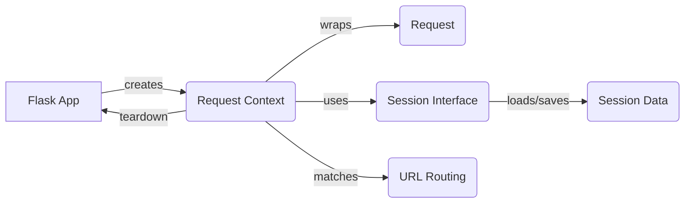

## Request Context Overview

The `RequestContext` component is central to Flask's request handling. It manages the lifecycle of a request, from its arrival to its completion, ensuring that all necessary resources are available and cleaned up properly. It acts as a container for request-specific data, such as the `Request` and `Session` objects, and provides mechanisms for pushing and popping the context, which makes the request-specific data available to other parts of the application.

Here's a data flow diagram illustrating the role of the `RequestContext`:

### Component Descriptions:

*   **Flask App:** The core Flask application instance. It receives incoming requests and creates a `RequestContext` to handle each request. After the request is processed, the Flask app handles the response and any necessary teardown.
    *   Relevant source files: `repos.flask.src.flask.app.Flask`

*   **Request Context:** Manages the request-specific context. It wraps the `Request` object, uses the `Session Interface` to load and save session data, and matches the request to a URL route. It also handles teardown functions to clean up resources after the request is processed.
    *   Relevant source files: `repos.flask.src.flask.ctx.RequestContext`

*   **Request:** Wraps the incoming WSGI environment and provides a convenient interface for accessing request data. It is created by the `RequestContext` and contains information about the request, such as the URL, headers, and form data.
    *   Relevant source files: `repos.flask.src.flask.wrappers.Request`

*   **Session Interface:** Defines the interface for managing user sessions. The `RequestContext` uses the `Session Interface` to load session data at the beginning of the request and save it at the end. It provides methods for creating null sessions and managing cookie parameters.
    *   Relevant source files: `repos.flask.src.flask.sessions.SessionInterface`

*   **Session Data:** The actual session data, which is loaded and saved by the `Session Interface`. This data is typically stored in a cookie or other persistent storage.

*   **URL Routing:** The process of matching the incoming request URL to a specific view function. The `RequestContext` uses the URL routing rules defined in the Flask app to determine which view function should handle the request.

