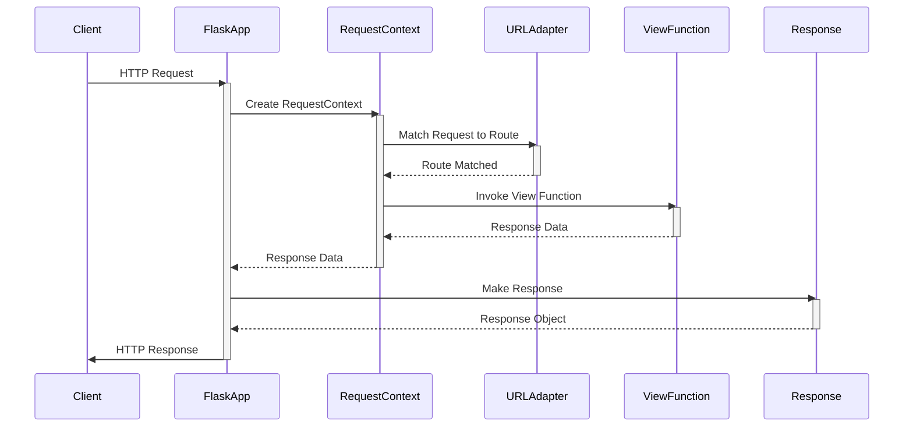
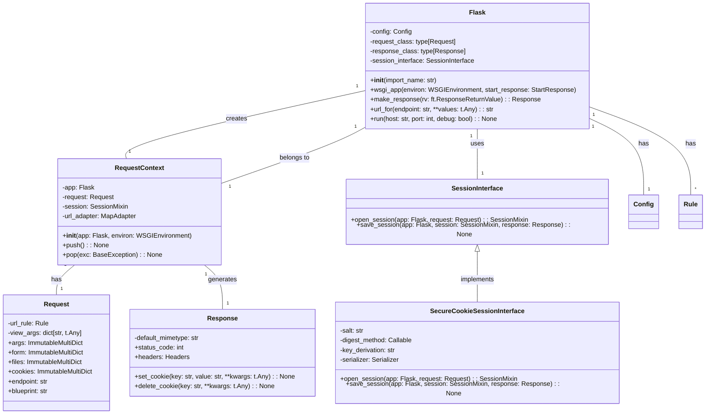

Okay, I have analyzed the source code of the Flask application and its related components. Here's a breakdown of the component's overview, structure, flow, and purpose.

**Component Description**

The Flask component is a micro web framework written in Python. Its primary purpose is to facilitate the creation of web applications by providing tools and libraries for request handling, routing, templating, and more. The core of Flask revolves around the `Flask` class, which acts as the central application object. It manages the application's configuration, URL routing, request and response handling, and integration with other components.

**Main Classes and Their Purposes**

1.  **`Flask`**: The central application object. It initializes the application, manages configuration, defines URL routes, and handles request dispatching.
2.  **`Request`**: Encapsulates an HTTP request. It provides access to request data, such as form parameters, query strings, headers, and cookies.
3.  **`Response`**: Represents an HTTP response. It allows setting the response body, status code, headers, and cookies.
4.  **`RequestContext`**: Manages the context of a request. It's created at the beginning of a request and destroyed at the end. It provides access to the application, request, and session objects.
5.  **`SecureCookieSessionInterface`**: Implements session management using secure cookies. It handles the creation, loading, and saving of user sessions.

**Main Flow**

The main flow within the Flask component can be summarized as follows:

1.  **Request Arrival**: A client sends an HTTP request to the Flask application.
2.  **Context Creation**: The `Flask` application creates a `RequestContext` for the request.
3.  **Request Matching**: The `RequestContext` uses the URL adapter to match the request URL to a registered route.
4.  **View Function Invocation**: The matched route's view function is invoked to handle the request.
5.  **Response Generation**: The view function processes the request and returns a response (either directly or indirectly).
6.  **Response Processing**: The `Flask` application converts the return value from the view function into a `Response` object.
7.  **Context Teardown**: The `RequestContext` is popped, triggering teardown functions and cleanup.
8.  **Response Sending**: The `Response` object is sent back to the client.

**Class Diagram**

