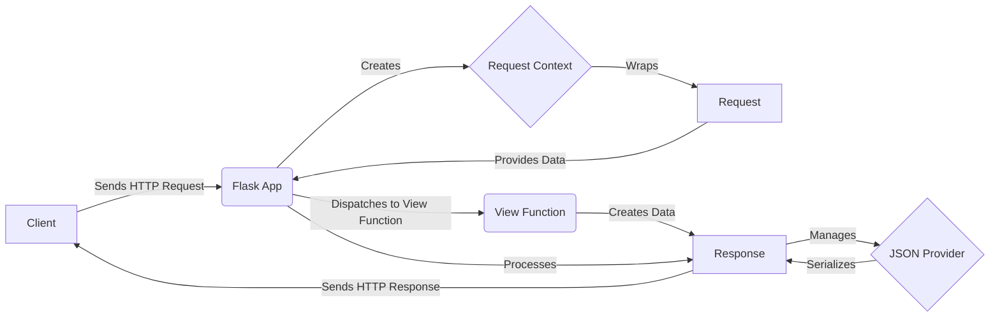

```mermaid
graph LR
    A[Client] -- Sends HTTP Request --> B(Flask App) 
    B -- Creates --> C{Request Context}
    C -- Wraps --> D[Request]
    D -- Provides Data --> B
    B -- Dispatches to View Function --> E(View Function)
    E -- Creates Data --> F[Response]
    F -- Manages --> G{JSON Provider}
    G -- Serializes --> F
    B -- Processes --> F
    F -- Sends HTTP Response --> A


```