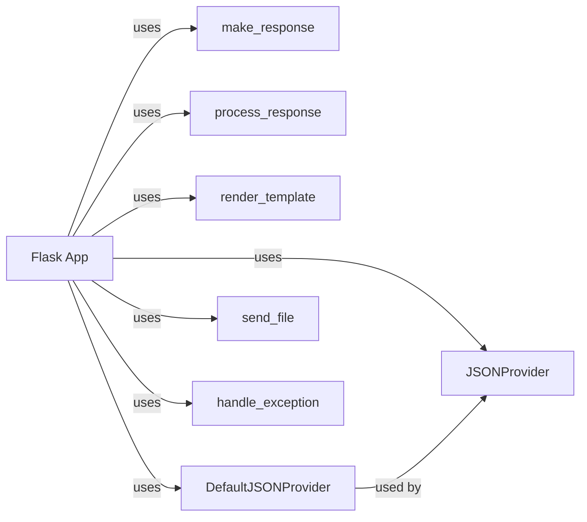

## Component Details

The Response Handling component in Flask is responsible for taking the output of a view function and converting it into a proper HTTP response that can be sent to the client. This involves several steps, including determining the response type, setting appropriate headers, serializing data (e.g., JSON), and rendering templates. The Flask application class orchestrates this process, utilizing helper functions and template engines to generate the final response.

### Flask App
The core Flask application class that receives requests and orchestrates the response generation process. It dispatches requests to view functions and uses helper functions to construct and process the response.
- **Related Classes/Methods**: `flask.src.flask.app.Flask`

### make_response
This method converts the return value of a view function into a `Response` object. It handles various return types, including strings, dictionaries, and Response objects, ensuring a consistent response format.
- **Related Classes/Methods**: `flask.src.flask.app.Flask:make_response`

### process_response
This method allows modifying the `Response` object before it is sent to the client. It applies response processors registered with the application, enabling tasks like setting cookies or adding headers to the response.
- **Related Classes/Methods**: `flask.src.flask.app.Flask:process_response`

### render_template
This function renders a Jinja2 template and returns the rendered output as a string. It integrates with the application's template engine to generate dynamic HTML content for the response.
- **Related Classes/Methods**: `flask.src.flask.templating:render_template`

### JSONProvider
This abstract class provides JSON encoding and decoding functionality. Concrete implementations, like `DefaultJSONProvider`, handle the actual serialization and deserialization processes for JSON responses.
- **Related Classes/Methods**: `flask.src.flask.json.provider.JSONProvider`

### DefaultJSONProvider
The default JSON provider used by Flask, which relies on the standard library's `json` module for encoding and decoding JSON data. It's responsible for serializing Python objects into JSON format for responses.
- **Related Classes/Methods**: `flask.src.flask.json.provider.DefaultJSONProvider`

### send_file
A helper function that sends a file as a response, setting appropriate headers and handling file streaming. It's used for serving static files or other file-based content.
- **Related Classes/Methods**: `flask.src.flask.helpers:send_file`

### handle_exception
This method handles exceptions raised during request processing. It allows registering custom exception handlers to provide specific error responses, ensuring graceful error handling.
- **Related Classes/Methods**: `flask.src.flask.app.Flask:handle_exception`
