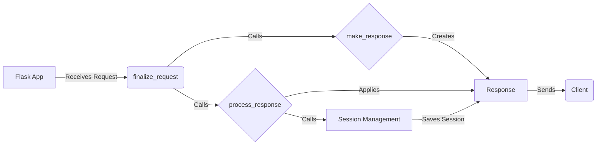

```mermaid
graph LR
    A[Flask App] -- Receives Request --> B(finalize_request)
    B -- Calls --> C{make_response}
    C -- Creates --> D[Response]
    B -- Calls --> E{process_response}
    E -- Applies --> D
    E -- Calls --> F[Session Management]
    F -- Saves Session --> D
    D -- Sends --> G(Client)


```