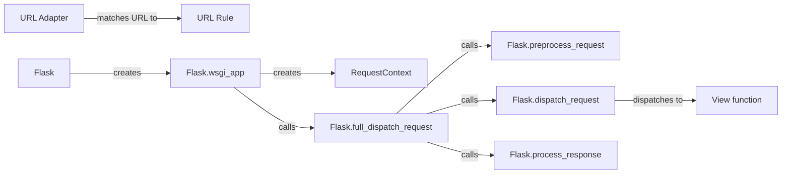

## Component Details

The routing and dispatch component is responsible for mapping incoming URLs to the appropriate view functions and executing them. It involves processing the request, finding the correct view function based on the URL, and then calling that function to generate a response. The Flask application uses URL rules and a URL adapter to match URLs to view functions. Request contexts are created to manage request-specific data, and the application dispatches the request through a series of steps including preprocessing, dispatching to the view function, and processing the response.

### Flask
The Flask class represents the WSGI application and is the central point for handling requests, managing application context, and configuring the application. It initializes the application, loads configuration, and registers blueprints and extensions.
- **Related Classes/Methods**: `flask.src.flask.app.Flask`

### URL Rule
URL rules define the mapping between URLs and view functions. They specify the URL pattern, HTTP methods, and other options for a route, enabling the application to define its API and handle different types of requests.
- **Related Classes/Methods**: `werkzeug.routing.Rule`

### URL Adapter
The URL adapter is responsible for matching the incoming URL to a URL rule. It uses the URL map to find the appropriate rule and extract any parameters from the URL, facilitating the routing of requests to the correct view function.
- **Related Classes/Methods**: `werkzeug.routing.MapAdapter`

### RequestContext
The RequestContext class encapsulates the request-specific state, such as the request object, session, and URL adapter. It is created at the beginning of each request and destroyed at the end, providing a context for request processing.
- **Related Classes/Methods**: `flask.src.flask.ctx.RequestContext`

### Flask.wsgi_app
This method is the WSGI application and handles incoming requests. It creates the request and application contexts, dispatches the request to the appropriate view function, and handles any exceptions, serving as the entry point for all requests.
- **Related Classes/Methods**: `flask.src.flask.app.Flask:wsgi_app`

### Flask.full_dispatch_request
This method performs the actual dispatching of the request. It preprocesses the request, dispatches it to the view function, and then processes the response. It handles exception handling and response modification, ensuring the request is properly handled.
- **Related Classes/Methods**: `flask.src.flask.app.Flask:full_dispatch_request`

### Flask.preprocess_request
This method is called before each request and can be used to perform actions such as authentication or authorization. It allows running code before the view function is called, enabling request preprocessing.
- **Related Classes/Methods**: `flask.src.flask.app.Flask:preprocess_request`

### Flask.dispatch_request
This method dispatches the request to the appropriate view function based on the URL. It uses the URL adapter to match the URL and then calls the view function, routing the request to the correct handler.
- **Related Classes/Methods**: `flask.src.flask.app.Flask:dispatch_request`

### Flask.process_response
This method is called after each request and can be used to modify the response before it is sent to the client. It allows running code after the view function is called, enabling response post-processing.
- **Related Classes/Methods**: `flask.src.flask.app.Flask:process_response`

### View function
View functions are the functions that handle incoming requests and return a response. They are associated with a URL rule and are called when the URL is matched, generating the response for a specific request.
- **Related Classes/Methods**: _None_
