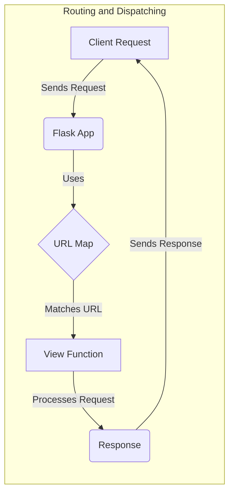

## Routing and Dispatching Overview

This section provides an overview of the routing and dispatching mechanism in Flask, detailing how URLs are mapped to view functions and how requests are processed.

### Data Flow Diagram

### Component Descriptions

*   **Client Request:** Represents the initial HTTP request sent by a client (e.g., a web browser).
    *   **Purpose:** Initiates the request processing flow.
    *   **Interaction:** Sends the request to the Flask application.
    *   **Relevant source files:** N/A

*   **Flask App:** The core Flask application instance that receives the request and orchestrates the routing and dispatching process.
    *   **Purpose:** Manages the application context, URL routing, and request dispatching.
    *   **Interaction:** Receives the request, uses the URL map to find the appropriate view function, and dispatches the request to that function.
    *   **Relevant source files:** `repos.flask.src.flask.app.Flask`

*   **URL Map:** A collection of URL rules that maps URLs to specific view functions.
    *   **Purpose:** Stores the URL patterns and provides a mechanism for matching incoming requests to the correct view function.
    *   **Interaction:** The Flask app uses the URL map to find the view function that matches the requested URL.
    *   **Relevant source files:** `werkzeug.routing.Map`, `werkzeug.routing.Rule`

*   **View Function:** A function that handles the request and generates a response.
    *   **Purpose:** Processes the request data, performs the necessary actions, and returns a response to the client.
    *   **Interaction:** Receives the request from the Flask app, processes it, and returns a response.
    *   **Relevant source files:** `flask.view_functions`

*   **Response:** The HTTP response generated by the view function.
    *   **Purpose:** Contains the data and headers that are sent back to the client.
    *   **Interaction:** Sent back to the client as a result of the request processing.
    *   **Relevant source files:** N/A
