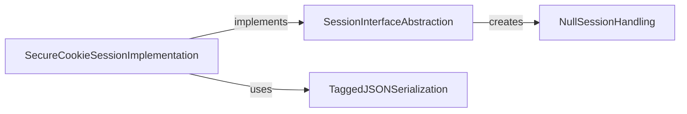

## Component Details

This component overview describes the Session & Data Management subsystem in Flask. It outlines how user sessions are managed, primarily through secure cookies, and details the mechanisms for serializing and deserializing Python objects to and from JSON. The core functionality revolves around an abstract session interface, its secure cookie-based implementation, a null session fallback for error handling, and a specialized JSON serializer for complex Python objects.

### SessionInterfaceAbstraction
Defines the abstract contract for session management in Flask applications. It provides methods for creating null sessions, checking session types, and retrieving various cookie-related parameters, serving as the base for concrete session implementations.

**Related Classes/Methods**:

- <a href="https://github.com/pallets/flask/blob/master/src/flask/sessions.py#L114-L284" target="_blank" rel="noopener noreferrer">`flask.src.flask.sessions.SessionInterface` (114:284)</a>
- <a href="https://github.com/pallets/flask/blob/master/src/flask/sessions.py#L164-L174" target="_blank" rel="noopener noreferrer">`flask.src.flask.sessions.SessionInterface:make_null_session` (164:174)</a>
- <a href="https://github.com/pallets/flask/blob/master/src/flask/sessions.py#L176-L183" target="_blank" rel="noopener noreferrer">`flask.src.flask.sessions.SessionInterface:is_null_session` (176:183)</a>
- <a href="https://github.com/pallets/flask/blob/master/src/flask/sessions.py#L185-L187" target="_blank" rel="noopener noreferrer">`flask.src.flask.sessions.SessionInterface:get_cookie_name` (185:187)</a>
- <a href="https://github.com/pallets/flask/blob/master/src/flask/sessions.py#L189-L199" target="_blank" rel="noopener noreferrer">`flask.src.flask.sessions.SessionInterface:get_cookie_domain` (189:199)</a>
- <a href="https://github.com/pallets/flask/blob/master/src/flask/sessions.py#L201-L207" target="_blank" rel="noopener noreferrer">`flask.src.flask.sessions.SessionInterface:get_cookie_path` (201:207)</a>
- <a href="https://github.com/pallets/flask/blob/master/src/flask/sessions.py#L209-L214" target="_blank" rel="noopener noreferrer">`flask.src.flask.sessions.SessionInterface:get_cookie_httponly` (209:214)</a>
- <a href="https://github.com/pallets/flask/blob/master/src/flask/sessions.py#L216-L220" target="_blank" rel="noopener noreferrer">`flask.src.flask.sessions.SessionInterface:get_cookie_secure` (216:220)</a>
- <a href="https://github.com/pallets/flask/blob/master/src/flask/sessions.py#L222-L227" target="_blank" rel="noopener noreferrer">`flask.src.flask.sessions.SessionInterface:get_cookie_samesite` (222:227)</a>
- <a href="https://github.com/pallets/flask/blob/master/src/flask/sessions.py#L229-L235" target="_blank" rel="noopener noreferrer">`flask.src.flask.sessions.SessionInterface:get_cookie_partitioned` (229:235)</a>
- <a href="https://github.com/pallets/flask/blob/master/src/flask/sessions.py#L237-L245" target="_blank" rel="noopener noreferrer">`flask.src.flask.sessions.SessionInterface:get_expiration_time` (237:245)</a>
- <a href="https://github.com/pallets/flask/blob/master/src/flask/sessions.py#L247-L261" target="_blank" rel="noopener noreferrer">`flask.src.flask.sessions.SessionInterface:should_set_cookie` (247:261)</a>
- <a href="https://github.com/pallets/flask/blob/master/src/flask/sessions.py#L24-L49" target="_blank" rel="noopener noreferrer">`flask.src.flask.sessions.SessionMixin` (24:49)</a>

### SecureCookieSessionImplementation
A concrete implementation of the session interface that stores session data securely in signed cookies. It leverages itsdangerous for signing and provides methods for opening and saving sessions, including handling serialization and deserialization of session data.

**Related Classes/Methods**:

- <a href="https://github.com/pallets/flask/blob/master/src/flask/sessions.py#L298-L399" target="_blank" rel="noopener noreferrer">`flask.src.flask.sessions.SecureCookieSessionInterface` (298:399)</a>
- <a href="https://github.com/pallets/flask/blob/master/src/flask/sessions.py#L337-L349" target="_blank" rel="noopener noreferrer">`flask.src.flask.sessions.SecureCookieSessionInterface:open_session` (337:349)</a>
- <a href="https://github.com/pallets/flask/blob/master/src/flask/sessions.py#L351-L399" target="_blank" rel="noopener noreferrer">`flask.src.flask.sessions.SecureCookieSessionInterface:save_session` (351:399)</a>
- <a href="https://github.com/pallets/flask/blob/master/src/flask/sessions.py#L317-L335" target="_blank" rel="noopener noreferrer">`flask.src.flask.sessions.SecureCookieSessionInterface:get_signing_serializer` (317:335)</a>
- <a href="https://github.com/pallets/flask/blob/master/src/flask/sessions.py#L52-L94" target="_blank" rel="noopener noreferrer">`flask.src.flask.sessions.SecureCookieSession` (52:94)</a>

### NullSessionHandling
Provides a fallback session object when a valid session cannot be established, typically due to missing configuration like a secret key. It allows read-only access but prevents modifications, guiding the user to resolve the configuration issue.

**Related Classes/Methods**:

- <a href="https://github.com/pallets/flask/blob/master/src/flask/sessions.py#L97-L111" target="_blank" rel="noopener noreferrer">`flask.src.flask.sessions.NullSession` (97:111)</a>

### TaggedJSONSerialization
A specialized JSON serializer used for handling session data, capable of tagging and untagging Python objects (like datetime and tuple) to ensure they can be correctly serialized and deserialized to and from JSON.

**Related Classes/Methods**:

- <a href="https://github.com/pallets/flask/blob/master/src/flask/json/tag.py#L219-L327" target="_blank" rel="noopener noreferrer">`flask.src.flask.json.tag.TaggedJSONSerializer` (219:327)</a>
- <a href="https://github.com/pallets/flask/blob/master/src/flask/json/tag.py#L321-L323" target="_blank" rel="noopener noreferrer">`flask.src.flask.json.tag.TaggedJSONSerializer:dumps` (321:323)</a>
- <a href="https://github.com/pallets/flask/blob/master/src/flask/json/tag.py#L325-L327" target="_blank" rel="noopener noreferrer">`flask.src.flask.json.tag.TaggedJSONSerializer:loads` (325:327)</a>
- <a href="https://github.com/pallets/flask/blob/master/src/flask/json/tag.py#L309-L319" target="_blank" rel="noopener noreferrer">`flask.src.flask.json.tag.TaggedJSONSerializer._untag_scan` (309:319)</a>
- `flask.src.flask.json.dumps` (full file reference)
- `flask.src.flask.json.loads` (full file reference)

### [FAQ](https://github.com/CodeBoarding/GeneratedOnBoardings/tree/main?tab=readme-ov-file#faq)