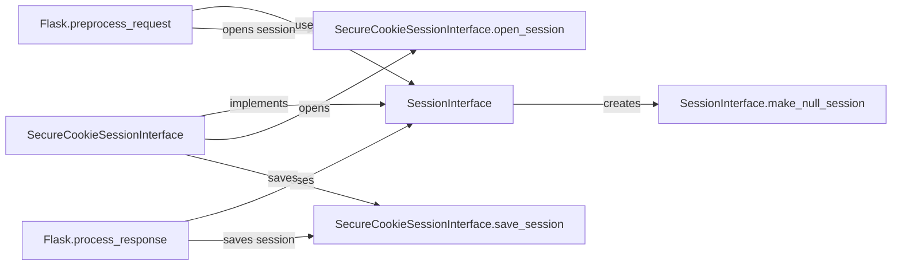

## Component Details

The Sessions and Security component in Flask manages user sessions and ensures application security. It revolves around the `SessionInterface` and `SecureCookieSessionInterface` to handle session creation, storage, and retrieval using secure cookies. The component integrates with Flask's request lifecycle to open sessions at the beginning of a request and save them at the end, providing a mechanism for maintaining user-specific data across multiple requests. CSRF protection is also a key aspect of this component, safeguarding against cross-site request forgery attacks.

### SessionInterface
The SessionInterface is an abstract class that defines the interface for implementing session management in Flask. It provides methods for opening a session at the beginning of a request, saving the session at the end of a request, and creating a null session when no session exists.
- **Related Classes/Methods**: `flask.src.flask.sessions.SessionInterface`

### SecureCookieSessionInterface
SecureCookieSessionInterface is a concrete implementation of SessionInterface that uses secure cookies to store session data on the client-side. It encrypts and signs the session data to prevent tampering and ensures data confidentiality. It handles the serialization and deserialization of session data to and from the cookie.
- **Related Classes/Methods**: `flask.src.flask.sessions.SecureCookieSessionInterface`

### Flask.preprocess_request
Flask's preprocess_request is a component that executes before each request. It is responsible for preparing the request context, which includes opening the session using the configured SessionInterface. This ensures that session data is available to the view function.
- **Related Classes/Methods**: `flask.src.flask.app.Flask:preprocess_request`

### Flask.process_response
Flask's process_response is a component that executes after the view function returns a response. It is responsible for processing the response, which includes saving the session data using the configured SessionInterface. This ensures that any changes made to the session during the request are persisted.
- **Related Classes/Methods**: `flask.src.flask.app.Flask:process_response`

### SessionInterface.make_null_session
The make_null_session method of the SessionInterface is responsible for creating a null session object when no session cookie is present or when the session is disabled. This allows the application to handle requests without an active session gracefully.
- **Related Classes/Methods**: `flask.src.flask.sessions.SessionInterface:make_null_session`

### SecureCookieSessionInterface.open_session
The open_session method of the SecureCookieSessionInterface is responsible for opening the session at the beginning of a request. It retrieves the session data from the secure cookie, decrypts it, and deserializes it into a session object.
- **Related Classes/Methods**: `flask.src.flask.sessions.SecureCookieSessionInterface:open_session`

### SecureCookieSessionInterface.save_session
The save_session method of the SecureCookieSessionInterface is responsible for saving the session at the end of a request. It serializes the session data, encrypts it, signs it, and stores it in a secure cookie.
- **Related Classes/Methods**: `flask.src.flask.sessions.SecureCookieSessionInterface:save_session`
