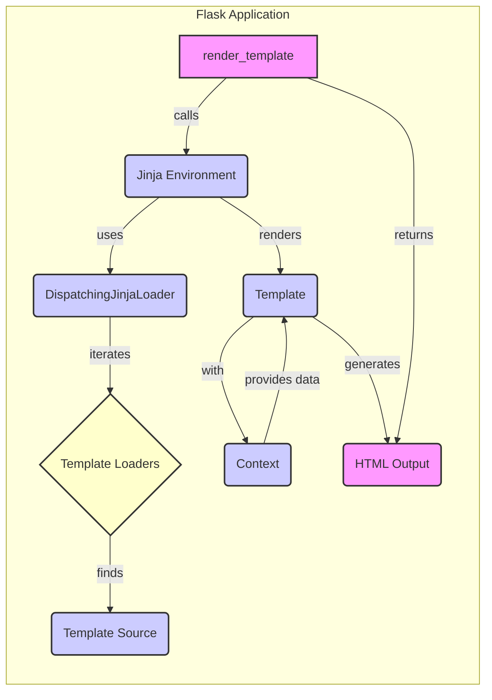

## Template Rendering Overview

This diagram illustrates the flow of template rendering in Flask, focusing on how templates are loaded, rendered, and how the context is managed.

## Components

- **render_template**
  - *Description*: This function is the entry point for rendering templates. It retrieves the Jinja environment from the Flask application and uses it to render the specified template with the given context.
  - *Functionality*: It calls the Jinja environment to get the template and then triggers the rendering process.
  - *Related Files*: `flask.templating.render_template`

- **Jinja Environment**
  - *Description*: Manages the Jinja environment, including the template loader and context.
  - *Functionality*: It is responsible for creating the Jinja environment and configuring the template loader. It also handles the context management during rendering.
  - *Related Files*: `flask.templating.Environment`, `flask.app.Flask.create_jinja_environment`

- **DispatchingJinjaLoader**
  - *Description*: Loads templates from the application and blueprint folders.
  - *Functionality*: It iterates through the available template loaders (application and blueprints) to find the template source.
  - *Related Files*: `flask.templating.DispatchingJinjaLoader`

- **Template Loaders**
  - *Description*: Abstraction representing different template loaders (e.g., file system loader).
  - *Functionality*: Provides the mechanism to load templates from various sources.
  - *Related Files*: (Abstract - implementations vary)

- **Template Source**
  - *Description*: The actual template file.
  - *Functionality*: Contains the Jinja2 template code.
  - *Related Files*: (File system)

- **Template**
  - *Description*: Represents the compiled Jinja2 template.
  - *Functionality*: Renders the template with the provided context.
  - *Related Files*: (Jinja2 internals)

- **Context**
  - *Description*: The data passed to the template for rendering.
  - *Functionality*: Provides the variables that are used in the template to generate the final output.
  - *Related Files*: `flask.helpers.stream_with_context`

- **HTML Output**
  - *Description*: The final HTML content generated by rendering the template.
  - *Functionality*: The result of the template rendering process, which is sent back to the client.
  - *Related Files*: N/A
