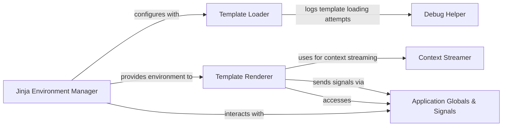

## Component Details

The Templating & Rendering subsystem in Flask is responsible for dynamically generating HTML content using Jinja2 templates. It handles the entire lifecycle of template processing, from locating the template files to rendering them with provided context data and streaming the final output to the client. This subsystem integrates closely with the Flask application's configuration and request context to provide a seamless templating experience.

### Template Loader
This component is responsible for locating and retrieving the source code of templates. It can operate in a fast mode or a more verbose, explained mode for debugging template loading issues. It iterates through various loaders (application-level and blueprint-specific) to find the template.

**Related Classes/Methods**:

- <a href="https://github.com/pallets/flask/blob/master/src/flask/templating.py#L52-L123" target="_blank" rel="noopener noreferrer">`flask.src.flask.templating.DispatchingJinjaLoader` (52:123)</a>
- <a href="https://github.com/pallets/flask/blob/master/src/flask/templating.py#L60-L65" target="_blank" rel="noopener noreferrer">`flask.src.flask.templating.DispatchingJinjaLoader:get_source` (60:65)</a>
- <a href="https://github.com/pallets/flask/blob/master/src/flask/templating.py#L67-L89" target="_blank" rel="noopener noreferrer">`flask.src.flask.templating.DispatchingJinjaLoader._get_source_explained` (67:89)</a>
- <a href="https://github.com/pallets/flask/blob/master/src/flask/templating.py#L91-L99" target="_blank" rel="noopener noreferrer">`flask.src.flask.templating.DispatchingJinjaLoader._get_source_fast` (91:99)</a>
- <a href="https://github.com/pallets/flask/blob/master/src/flask/templating.py#L101-L109" target="_blank" rel="noopener noreferrer">`flask.src.flask.templating.DispatchingJinjaLoader._iter_loaders` (101:109)</a>

### Template Renderer
This component handles the process of rendering Jinja2 templates, either from a file path or a string, into a final output (string or a stream of strings). It updates the template context and sends signals before and after rendering.

**Related Classes/Methods**:

- <a href="https://github.com/pallets/flask/blob/master/src/flask/templating.py#L138-L150" target="_blank" rel="noopener noreferrer">`flask.src.flask.templating:render_template` (138:150)</a>
- <a href="https://github.com/pallets/flask/blob/master/src/flask/templating.py#L153-L162" target="_blank" rel="noopener noreferrer">`flask.src.flask.templating:render_template_string` (153:162)</a>
- <a href="https://github.com/pallets/flask/blob/master/src/flask/templating.py#L126-L135" target="_blank" rel="noopener noreferrer">`flask.src.flask.templating._render` (126:135)</a>
- <a href="https://github.com/pallets/flask/blob/master/src/flask/templating.py#L165-L185" target="_blank" rel="noopener noreferrer">`flask.src.flask.templating._stream` (165:185)</a>
- <a href="https://github.com/pallets/flask/blob/master/src/flask/templating.py#L188-L204" target="_blank" rel="noopener noreferrer">`flask.src.flask.templating:stream_template` (188:204)</a>
- <a href="https://github.com/pallets/flask/blob/master/src/flask/templating.py#L207-L219" target="_blank" rel="noopener noreferrer">`flask.src.flask.templating:stream_template_string` (207:219)</a>

### Jinja Environment Manager
This component is responsible for the creation and configuration of the Jinja2 environment used by the Flask application. It sets up the template loader and injects Flask-specific globals and filters into the environment.

**Related Classes/Methods**:

- <a href="https://github.com/pallets/flask/blob/master/src/flask/app.py#L385-L423" target="_blank" rel="noopener noreferrer">`flask.src.flask.app.Flask:create_jinja_environment` (385:423)</a>
- <a href="https://github.com/pallets/flask/blob/master/src/flask/templating.py#L39-L49" target="_blank" rel="noopener noreferrer">`flask.src.flask.templating.Environment` (39:49)</a>

### Debug Helper
This component provides utility functions for debugging, specifically for explaining template loading attempts.

**Related Classes/Methods**:

- <a href="https://github.com/pallets/flask/blob/master/src/flask/debughelpers.py#L124-L178" target="_blank" rel="noopener noreferrer">`flask.src.flask.debughelpers.explain_template_loading_attempts` (124:178)</a>

### Context Streamer
This component provides a utility to ensure that the request context remains active during the streaming of a response, allowing access to request-bound information within generator functions.

**Related Classes/Methods**:

- <a href="https://github.com/pallets/flask/blob/master/src/flask/helpers.py#L51-L53" target="_blank" rel="noopener noreferrer">`flask.src.flask.helpers.stream_with_context` (51:53)</a>

### Application Globals & Signals
This component represents the interaction with Flask's global objects (like current_app) and the signaling system, which allows other parts of the application to react to events like template rendering.

**Related Classes/Methods**:

- `flask.src.flask.globals` (full file reference)
- `flask.src.flask.signals` (full file reference)

### [FAQ](https://github.com/CodeBoarding/GeneratedOnBoardings/tree/main?tab=readme-ov-file#faq)