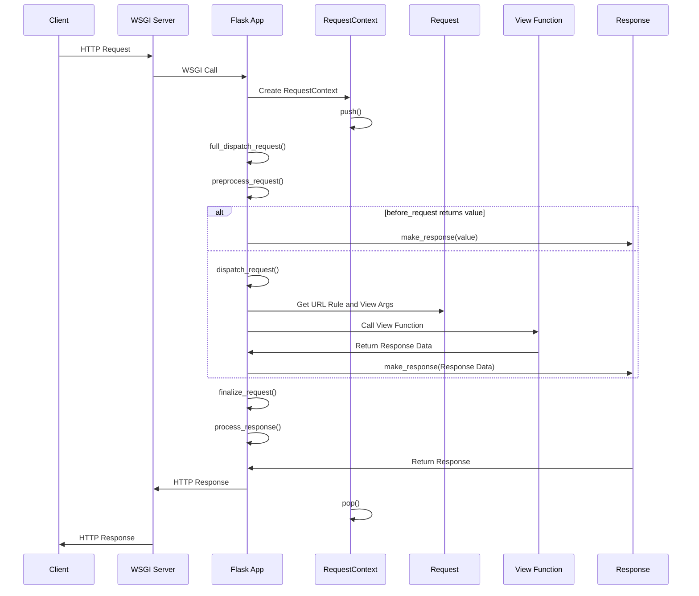
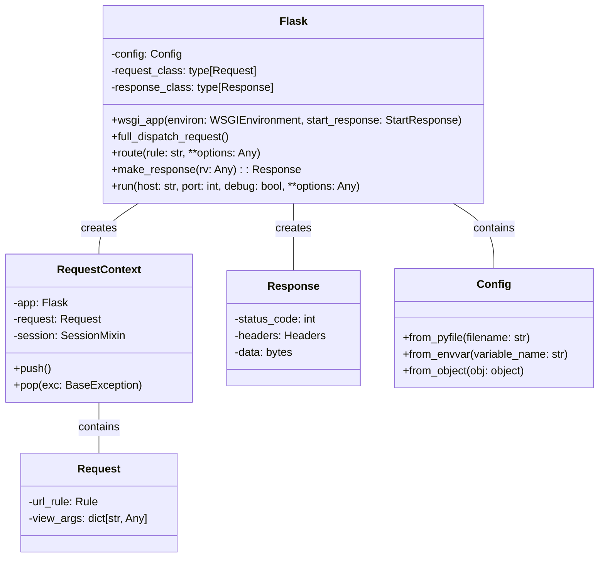

Okay, I have examined the source code of the core Flask components. Here's a breakdown of the Flask component, its structure, and main flow:

**Component Description:**

The Flask component is a micro web framework that provides tools and features for building web applications in Python. It's designed to be lightweight and modular, allowing developers to choose the components they need. The core of Flask revolves around handling HTTP requests and generating HTTP responses.

**Main Classes and Their Purposes:**

1.  **`Flask`**: The central application object. It manages the application's configuration, URL routing, request handling, and more. It inherits from `App` (Werkzeug).
    *   `__init__`: Initializes the Flask application, setting up the import name, static and template folders, instance path, and other configurations.
    *   `wsgi_app`: The WSGI application that handles incoming requests. It creates a request context, dispatches the request, and handles exceptions.
    *   `full_dispatch_request`: Performs request pre- and post-processing, dispatches the request to the appropriate view function, and handles exceptions.
    *   `route`: A decorator that registers a view function for a specific URL rule.
    *   `make_response`: Converts the return value of a view function into a `Response` object.
    *   `run`: Starts the development server.

2.  **`RequestContext`**: Manages the context of a single HTTP request. It stores request-specific information, such as the request object, session, and URL adapter.
    *   `__init__`: Initializes the request context with the Flask application, WSGI environment, request, and session.
    *   `push`: Pushes the request context onto the stack, making it the current context.
    *   `pop`: Pops the request context from the stack, cleaning up resources.

3.  **`Request`**: Represents an incoming HTTP request. It provides access to request data, such as headers, form data, and query parameters. It inherits from `RequestBase` (Werkzeug).
    *   `url_rule`: The URL rule that matched the request.
    *   `view_args`: A dictionary of view arguments that matched the request.

4.  **`Response`**: Represents an outgoing HTTP response. It contains the response body, status code, and headers. It inherits from `ResponseBase` (Werkzeug).

5.  **`Config`**: Manages the application's configuration. It allows loading configuration values from files, environment variables, and objects.
    *   `from_pyfile`: Loads configuration values from a Python file.
    *   `from_envvar`: Loads configuration values from an environment variable.
    *   `from_object`: Loads configuration values from an object.

6.  **`render_template`**: Renders a template using the Jinja2 templating engine.

**Main Flow:**

The main flow of a Flask application involves receiving an HTTP request, processing it, and generating an HTTP response. Here's a simplified sequence diagram:

**Class Diagram:**

Here's a class diagram representing the main structure of the Flask component:

