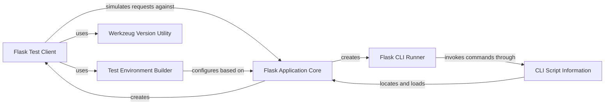

## Component Details

This overview details the core components involved in Flask's testing utilities, encompassing the simulation of HTTP requests and command-line interactions. The `Flask Test Client` and `Flask CLI Runner` are central, providing interfaces for testing web and CLI aspects of a Flask application, respectively. These components rely on the `Test Environment Builder` to set up realistic testing environments and the `CLI Script Information` to locate and load the Flask application. Ultimately, all testing utilities interact with the `Flask Application Core`, which represents the application under test, ensuring comprehensive and accurate testing.

### Flask Test Client
This component provides a high-level interface for simulating HTTP requests against a Flask application in a testing environment. It extends Werkzeug's test client and manages Flask-specific contexts, such as request and session contexts, to accurately mimic real application behavior during tests.

**Related Classes/Methods**:

- <a href="https://github.com/pallets/flask/blob/master/src/flask/testing.py#L109-L262" target="_blank" rel="noopener noreferrer">`flask.src.flask.testing.FlaskClient` (109:262)</a>
- <a href="https://github.com/pallets/flask/blob/master/src/flask/testing.py#L125-L133" target="_blank" rel="noopener noreferrer">`flask.src.flask.testing.FlaskClient:__init__` (125:133)</a>
- <a href="https://github.com/pallets/flask/blob/master/src/flask/testing.py#L193-L202" target="_blank" rel="noopener noreferrer">`flask.src.flask.testing.FlaskClient:_request_from_builder_args` (193:202)</a>
- <a href="https://github.com/pallets/flask/blob/master/src/flask/testing.py#L204-L247" target="_blank" rel="noopener noreferrer">`flask.src.flask.testing.FlaskClient:open` (204:247)</a>
- <a href="https://github.com/pallets/flask/blob/master/src/flask/testing.py#L185-L191" target="_blank" rel="noopener noreferrer">`flask.src.flask.testing.FlaskClient._copy_environ` (185:191)</a>

### Test Environment Builder
This component is responsible for constructing a WSGI environment dictionary, which simulates the environment of an incoming HTTP request. It integrates with the Flask application's configuration to set up parameters like base URLs, subdomains, and preferred URL schemes, ensuring the test environment accurately reflects the application's setup.

**Related Classes/Methods**:

- <a href="https://github.com/pallets/flask/blob/master/src/flask/testing.py#L27-L94" target="_blank" rel="noopener noreferrer">`flask.src.flask.testing.EnvironBuilder` (27:94)</a>
- <a href="https://github.com/pallets/flask/blob/master/src/flask/testing.py#L49-L86" target="_blank" rel="noopener noreferrer">`flask.src.flask.testing.EnvironBuilder:__init__` (49:86)</a>

### Werkzeug Version Utility
A simple utility function that retrieves the version string of the installed Werkzeug library. This information is primarily used by the Flask Test Client to set the User-Agent header in simulated requests, providing a more realistic testing environment.

**Related Classes/Methods**:

- <a href="https://github.com/pallets/flask/blob/master/src/flask/testing.py#L100-L106" target="_blank" rel="noopener noreferrer">`flask.src.flask.testing._get_werkzeug_version` (100:106)</a>

### Flask CLI Runner
This component facilitates the testing of Flask's command-line interface (CLI) commands. It extends Click's `CliRunner` and is specifically designed to invoke Flask CLI commands within an isolated environment, ensuring that the Flask application is properly loaded and accessible to the commands being tested.

**Related Classes/Methods**:

- <a href="https://github.com/pallets/flask/blob/master/src/flask/testing.py#L265-L298" target="_blank" rel="noopener noreferrer">`flask.src.flask.testing.FlaskCliRunner` (265:298)</a>
- <a href="https://github.com/pallets/flask/blob/master/src/flask/testing.py#L275-L298" target="_blank" rel="noopener noreferrer">`flask.src.flask.testing.FlaskCliRunner:invoke` (275:298)</a>

### CLI Script Information
This component acts as a central helper for Flask's command-line interface, responsible for locating and loading the Flask application instance. It abstracts away the complexities of finding the application, whether it's defined directly or through a factory function, and provides the necessary context for CLI commands to operate.

**Related Classes/Methods**:

- <a href="https://github.com/pallets/flask/blob/master/src/flask/cli.py#L293-L372" target="_blank" rel="noopener noreferrer">`flask.src.flask.cli.ScriptInfo` (293:372)</a>
- <a href="https://github.com/pallets/flask/blob/master/src/flask/cli.py#L305-L331" target="_blank" rel="noopener noreferrer">`flask.src.flask.cli.ScriptInfo:__init__` (305:331)</a>
- <a href="https://github.com/pallets/flask/blob/master/src/flask/cli.py#L333-L372" target="_blank" rel="noopener noreferrer">`flask.src.flask.cli.ScriptInfo:load_app` (333:372)</a>

### Flask Application Core
This is the main Flask application object, serving as the central registry for URL rules, view functions, and configuration. It manages the application and request contexts, dispatches requests, handles exceptions, and provides methods for creating test clients and CLI runners.

**Related Classes/Methods**:

- <a href="https://github.com/pallets/flask/blob/master/src/flask/app.py#L81-L1536" target="_blank" rel="noopener noreferrer">`flask.src.flask.app.Flask` (81:1536)</a>
- <a href="https://github.com/pallets/flask/blob/master/src/flask/app.py#L1423-L1477" target="_blank" rel="noopener noreferrer">`flask.src.flask.app.Flask:test_request_context` (1423:1477)</a>
- <a href="https://github.com/pallets/flask/blob/master/src/flask/app.py#L1407-L1421" target="_blank" rel="noopener noreferrer">`flask.src.flask.app.Flask:request_context` (1407:1421)</a>

### [FAQ](https://github.com/CodeBoarding/GeneratedOnBoardings/tree/main?tab=readme-ov-file#faq)