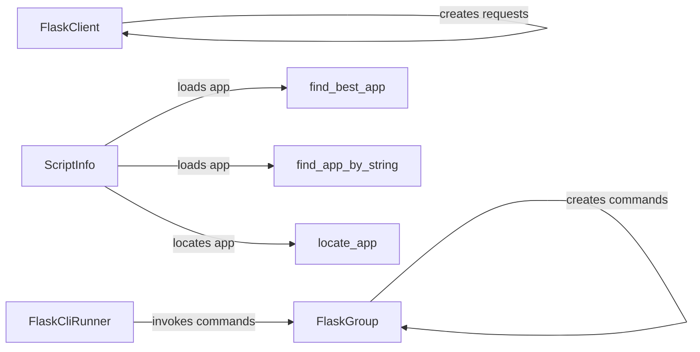

## Component Details

The Utilities component in Flask provides essential tools for testing and managing Flask applications. It includes a test client for simulating HTTP requests and asserting responses, a CLI runner for invoking Flask commands in a test environment, and utilities for locating and managing the Flask application instance within the CLI context. These components facilitate thorough testing and streamline administrative tasks, ensuring the application's quality and ease of use.

### FlaskClient
FlaskClient is a test client that allows you to make requests to your Flask application within a test environment. It provides methods for simulating various HTTP requests (GET, POST, PUT, DELETE, etc.) and inspecting the responses. It is used for testing the application's endpoints and ensuring they return the expected results.
- **Related Classes/Methods**: `flask.src.flask.testing.FlaskClient`

### FlaskCliRunner
FlaskCliRunner is a utility for invoking Flask CLI commands in a test environment. It captures the output of the command and provides a convenient way to assert the expected behavior. It is used for testing the application's CLI commands and ensuring they function as expected.
- **Related Classes/Methods**: `flask.src.flask.testing.FlaskCliRunner`

### ScriptInfo
ScriptInfo is a class that helps manage the Flask application instance within the CLI context. It is responsible for loading the application and providing access to it for CLI commands. It acts as a central point for accessing the application instance within the CLI environment.
- **Related Classes/Methods**: `flask.src.flask.cli.ScriptInfo`

### FlaskGroup
FlaskGroup is a custom Click group that is used as the top-level command group for Flask CLI applications. It provides features like automatically loading commands from the application and handling application context. It serves as the entry point for Flask CLI commands.
- **Related Classes/Methods**: `flask.src.flask.cli.FlaskGroup`

### find_best_app
This function attempts to locate the Flask application instance within a given Python module or package. It searches for common application variable names and returns the application if found. It is one of the methods used to locate the application instance for CLI commands.
- **Related Classes/Methods**: `flask.src.flask.cli:find_best_app`

### find_app_by_string
This function attempts to locate the Flask application instance by its string representation. It imports the module specified in the string and returns the application if found. It is another method used to locate the application instance for CLI commands.
- **Related Classes/Methods**: `flask.src.flask.cli:find_app_by_string`

### locate_app
This function attempts to locate the Flask application instance using different methods, including searching for it in the current working directory or by a string representation. It orchestrates the process of locating the application instance.
- **Related Classes/Methods**: `flask.src.flask.cli:locate_app`
