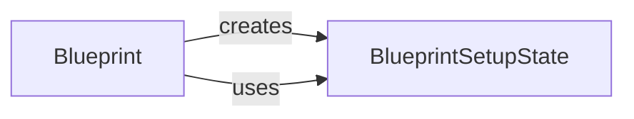

## Component Details

The Blueprint Management component in Flask provides a way to organize a Flask application into reusable parts. The core idea is to define blueprints, which are essentially mini-applications that can be registered to a main application. This allows for modularity and separation of concerns, making it easier to manage large applications. The Blueprint class is used to create these blueprints, and the BlueprintSetupState class manages the state during the registration process. URL rules are added to the blueprint, and when the blueprint is registered, these rules are merged into the main application's URL map. This system promotes code reusability and maintainability by allowing developers to define sets of routes, templates, and static files that can be easily reused across different parts of the application or in multiple applications.

### Blueprint
The Blueprint class is a central component for creating reusable sets of views and other components within a Flask application. It allows you to define routes, templates, static files, and other application-related logic in a modular way, which can then be registered with the main application.
**Related Classes/Methods**:

- <a href="https://github.com/pallets/flask/blob/master/src/flask/sansio/blueprints.py#L119-L632" target="_blank" rel="noopener noreferrer">`src.flask.sansio.blueprints.Blueprint` (119:632)</a>
- <a href="https://github.com/pallets/flask/blob/master/src/flask/sansio/blueprints.py#L273-L377" target="_blank" rel="noopener noreferrer">`src.flask.sansio.blueprints.Blueprint.register` (273:377)</a>
- <a href="https://github.com/pallets/flask/blob/master/src/flask/sansio/blueprints.py#L413-L441" target="_blank" rel="noopener noreferrer">`src.flask.sansio.blueprints.Blueprint.add_url_rule` (413:441)</a>
- <a href="https://github.com/pallets/flask/blob/master/src/flask/sansio/blueprints.py#L224-L230" target="_blank" rel="noopener noreferrer">`src.flask.sansio.blueprints.Blueprint.record` (224:230)</a>
- <a href="https://github.com/pallets/flask/blob/master/src/flask/sansio/blueprints.py#L233-L244" target="_blank" rel="noopener noreferrer">`src.flask.sansio.blueprints.Blueprint.record_once` (233:244)</a>
- <a href="https://github.com/pallets/flask/blob/master/src/flask/sansio/blueprints.py#L246-L253" target="_blank" rel="noopener noreferrer">`src.flask.sansio.blueprints.Blueprint.make_setup_state` (246:253)</a>
- <a href="https://github.com/pallets/flask/blob/master/src/flask/sansio/blueprints.py#L379-L410" target="_blank" rel="noopener noreferrer">`src.flask.sansio.blueprints.Blueprint._merge_blueprint_funcs` (379:410)</a>

### BlueprintSetupState
The BlueprintSetupState class is responsible for managing the state of a Blueprint during the registration process with a Flask application. It provides methods for adding URL rules and performing other setup tasks.
**Related Classes/Methods**:

- <a href="https://github.com/pallets/flask/blob/master/src/flask/sansio/blueprints.py#L34-L116" target="_blank" rel="noopener noreferrer">`src.flask.sansio.blueprints.BlueprintSetupState` (34:116)</a>
- <a href="https://github.com/pallets/flask/blob/master/src/flask/sansio/blueprints.py#L87-L116" target="_blank" rel="noopener noreferrer">`src.flask.sansio.blueprints.BlueprintSetupState.add_url_rule` (87:116)</a>