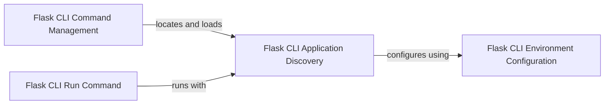

## Component Details

The Flask CLI Utilities component provides a command-line interface for managing Flask applications. It encompasses functionalities for discovering and loading Flask applications, defining and organizing CLI commands, configuring the environment, and running the development server. The component simplifies application management and deployment by providing a set of tools accessible through the command line.

### Flask CLI Application Discovery
This component is responsible for locating and loading the Flask application instance. It searches for the application by name or using the best available method and handles exceptions when the application cannot be found. It uses the application factory pattern and searches for the application in different locations.
**Related Classes/Methods**:

- <a href="https://github.com/pallets/flask/blob/master/src/flask/cli.py#L41-L91" target="_blank" rel="noopener noreferrer">`src.flask.cli:find_best_app` (41:91)</a>
- <a href="https://github.com/pallets/flask/blob/master/src/flask/cli.py#L120-L197" target="_blank" rel="noopener noreferrer">`src.flask.cli:find_app_by_string` (120:197)</a>
- <a href="https://github.com/pallets/flask/blob/master/src/flask/cli.py#L230-L232" target="_blank" rel="noopener noreferrer">`src.flask.cli:locate_app` (230:232)</a>
- <a href="https://github.com/pallets/flask/blob/master/src/flask/cli.py#L333-L372" target="_blank" rel="noopener noreferrer">`src.flask.cli.ScriptInfo:load_app` (333:372)</a>
- <a href="https://github.com/pallets/flask/blob/master/src/flask/cli.py#L37-L38" target="_blank" rel="noopener noreferrer">`src.flask.cli.NoAppException` (37:38)</a>

### Flask CLI Command Management
This component deals with defining and organizing Flask CLI commands. It includes adding commands to the application group, managing plugin commands, and creating the CLI context. It uses Click framework to define commands and options.
**Related Classes/Methods**:

- <a href="https://github.com/pallets/flask/blob/master/src/flask/cli.py#L413-L427" target="_blank" rel="noopener noreferrer">`src.flask.cli.AppGroup:command` (413:427)</a>
- <a href="https://github.com/pallets/flask/blob/master/src/flask/cli.py#L609-L634" target="_blank" rel="noopener noreferrer">`src.flask.cli.FlaskGroup:get_command` (609:634)</a>
- <a href="https://github.com/pallets/flask/blob/master/src/flask/cli.py#L636-L655" target="_blank" rel="noopener noreferrer">`src.flask.cli.FlaskGroup:list_commands` (636:655)</a>
- <a href="https://github.com/pallets/flask/blob/master/src/flask/cli.py#L657-L676" target="_blank" rel="noopener noreferrer">`src.flask.cli.FlaskGroup:make_context` (657:676)</a>

### Flask CLI Environment Configuration
This component handles loading environment variables from a file, which configures the Flask application's settings. It uses the `dotenv` library to load environment variables, allowing for flexible configuration of the application's behavior.
**Related Classes/Methods**:

- <a href="https://github.com/pallets/flask/blob/master/src/flask/cli.py#L493-L512" target="_blank" rel="noopener noreferrer">`src.flask.cli:_env_file_callback` (493:512)</a>
- <a href="https://github.com/pallets/flask/blob/master/src/flask/cli.py#L698-L763" target="_blank" rel="noopener noreferrer">`src.flask.cli.load_dotenv` (698:763)</a>

### Flask CLI Run Command
This component is responsible for running the Flask development server with specified configurations, such as SSL certificates and paths. It also displays the server banner, providing a user-friendly interface for starting and managing the server.
**Related Classes/Methods**:

- <a href="https://github.com/pallets/flask/blob/master/src/flask/cli.py#L935-L993" target="_blank" rel="noopener noreferrer">`src.flask.cli:run_command` (935:993)</a>
- <a href="https://github.com/pallets/flask/blob/master/src/flask/cli.py#L780-L825" target="_blank" rel="noopener noreferrer">`src.flask.cli.CertParamType` (780:825)</a>
- <a href="https://github.com/pallets/flask/blob/master/src/flask/cli.py#L867-L879" target="_blank" rel="noopener noreferrer">`src.flask.cli.SeparatedPathType` (867:879)</a>
- <a href="https://github.com/pallets/flask/blob/master/src/flask/cli.py#L766-L777" target="_blank" rel="noopener noreferrer">`src.flask.cli:show_server_banner` (766:777)</a>