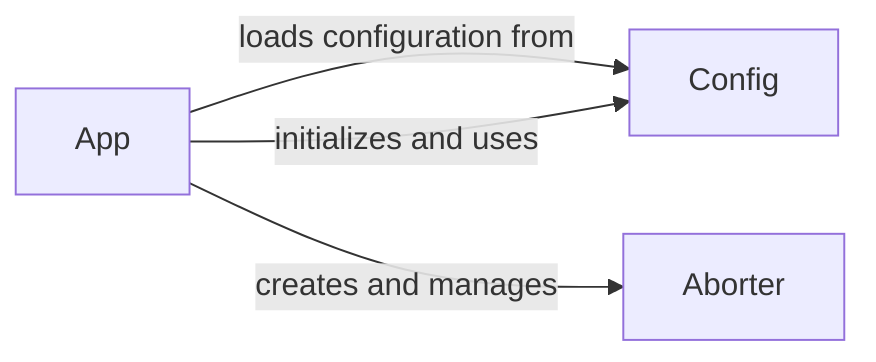

## Component Details

The configuration management subsystem in Flask is responsible for loading, storing, and providing access to application configuration settings. It allows developers to configure the application's behavior through various sources such as Python files, environment variables, and dictionaries. The `Config` object stores the configuration as a dictionary and provides methods to update and retrieve configuration values. The `App` object uses the `Config` object to manage the application's settings and the `Aborter` component uses the configuration to customize error handling.

### Config
The Config component in Flask manages the application's configuration settings. It provides methods to load configuration from various sources like Python files, environment variables, and objects. It stores configuration values as a dictionary and provides methods to access and modify them.
**Related Classes/Methods**:

- <a href="https://github.com/pallets/flask/blob/master/src/flask/config.py#L50-L367" target="_blank" rel="noopener noreferrer">`src.flask.config.Config` (50:367)</a>
- <a href="https://github.com/pallets/flask/blob/master/src/flask/config.py#L102-L124" target="_blank" rel="noopener noreferrer">`src.flask.config.Config.from_envvar` (102:124)</a>
- <a href="https://github.com/pallets/flask/blob/master/src/flask/config.py#L187-L216" target="_blank" rel="noopener noreferrer">`src.flask.config.Config.from_pyfile` (187:216)</a>
- <a href="https://github.com/pallets/flask/blob/master/src/flask/config.py#L256-L302" target="_blank" rel="noopener noreferrer">`src.flask.config.Config.from_file` (256:302)</a>
- <a href="https://github.com/pallets/flask/blob/master/src/flask/config.py#L304-L321" target="_blank" rel="noopener noreferrer">`src.flask.config.Config.from_mapping` (304:321)</a>
- <a href="https://github.com/pallets/flask/blob/master/src/flask/config.py#L218-L254" target="_blank" rel="noopener noreferrer">`src.flask.config.Config.from_object` (218:254)</a>

### App
The App component represents the Flask application instance. It initializes the application, sets up the configuration using the Config component, and manages request handling. It creates and manages the Aborter component for handling error responses.
**Related Classes/Methods**:

- <a href="https://github.com/pallets/flask/blob/master/src/flask/sansio/app.py#L59-L964" target="_blank" rel="noopener noreferrer">`src.flask.sansio.app.App` (59:964)</a>
- <a href="https://github.com/pallets/flask/blob/master/src/flask/sansio/app.py#L282-L411" target="_blank" rel="noopener noreferrer">`src.flask.sansio.app.App.__init__` (282:411)</a>
- <a href="https://github.com/pallets/flask/blob/master/src/flask/sansio/app.py#L510-L521" target="_blank" rel="noopener noreferrer">`src.flask.sansio.app.App.auto_find_instance_path` (510:521)</a>
- <a href="https://github.com/pallets/flask/blob/master/src/flask/sansio/app.py#L482-L496" target="_blank" rel="noopener noreferrer">`src.flask.sansio.app.App.make_config` (482:496)</a>
- <a href="https://github.com/pallets/flask/blob/master/src/flask/sansio/app.py#L498-L508" target="_blank" rel="noopener noreferrer">`src.flask.sansio.app.App.make_aborter` (498:508)</a>

### Aborter
The Aborter component in Flask is responsible for handling exceptions and error responses. It provides a way to abort a request and return an error page to the user. It is created and managed by the App component, and its behavior can be customized through configuration settings.
**Related Classes/Methods**:

- <a href="https://github.com/pallets/flask/blob/master/src/flask/sansio/app.py#L10-L54" target="_blank" rel="noopener noreferrer">`src.flask.sansio.abort.Aborter` (10:54)</a>