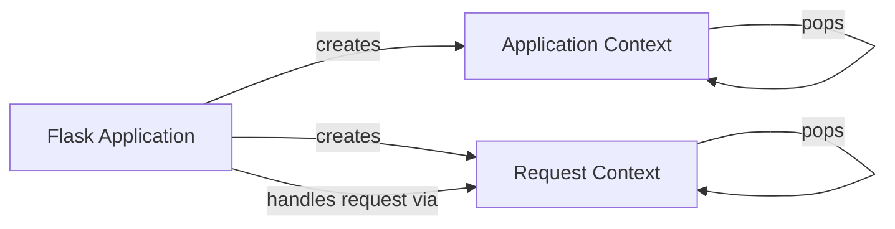

## Component Details

The context management system in Flask is responsible for managing the application and request contexts. These contexts provide a way to access application-specific and request-specific data within view functions and other parts of the application. The system ensures that the necessary data is available when needed and cleaned up afterward, maintaining a clean and organized execution environment. The Flask application creates and manages both application and request contexts, pushing them onto a stack when they are active and popping them off when they are no longer needed. This mechanism allows Flask to maintain a clean and isolated execution environment for each request.

### Flask Application
The Flask application class is the central object that manages the application lifecycle, including request handling, context management, and exception handling. It initializes the WSGI environment and dispatches requests to the appropriate view functions.
**Related Classes/Methods**:

- <a href="https://github.com/pallets/flask/blob/master/src/flask/app.py#L81-L1536" target="_blank" rel="noopener noreferrer">`src.flask.app.Flask` (81:1536)</a>
- <a href="https://github.com/pallets/flask/blob/master/src/flask/app.py#L1479-L1527" target="_blank" rel="noopener noreferrer">`src.flask.app.Flask:wsgi_app` (1479:1527)</a>
- <a href="https://github.com/pallets/flask/blob/master/src/flask/app.py#L1423-L1477" target="_blank" rel="noopener noreferrer">`src.flask.app.Flask:test_request_context` (1423:1477)</a>
- <a href="https://github.com/pallets/flask/blob/master/src/flask/app.py#L1407-L1421" target="_blank" rel="noopener noreferrer">`src.flask.app.Flask.request_context` (1407:1421)</a>
- <a href="https://github.com/pallets/flask/blob/master/src/flask/app.py#L904-L920" target="_blank" rel="noopener noreferrer">`src.flask.app.Flask.full_dispatch_request` (904:920)</a>
- <a href="https://github.com/pallets/flask/blob/master/src/flask/app.py#L811-L862" target="_blank" rel="noopener noreferrer">`src.flask.app.Flask.handle_exception` (811:862)</a>

### Application Context
The application context (`AppContext`) manages resources at the application level, such as the application configuration and database connections. It is entered and exited using `__enter__` and `__exit__`, which push and pop the context, respectively.
**Related Classes/Methods**:

- <a href="https://github.com/pallets/flask/blob/master/src/flask/ctx.py#L238-L284" target="_blank" rel="noopener noreferrer">`src.flask.ctx.AppContext` (238:284)</a>
- <a href="https://github.com/pallets/flask/blob/master/src/flask/ctx.py#L274-L276" target="_blank" rel="noopener noreferrer">`src.flask.ctx.AppContext:__enter__` (274:276)</a>
- <a href="https://github.com/pallets/flask/blob/master/src/flask/ctx.py#L278-L284" target="_blank" rel="noopener noreferrer">`src.flask.ctx.AppContext:__exit__` (278:284)</a>
- <a href="https://github.com/pallets/flask/blob/master/src/flask/ctx.py#L251-L254" target="_blank" rel="noopener noreferrer">`flask.src.flask.ctx.AppContext.push` (251:254)</a>
- <a href="https://github.com/pallets/flask/blob/master/src/flask/ctx.py#L256-L272" target="_blank" rel="noopener noreferrer">`flask.src.flask.ctx.AppContext.pop` (256:272)</a>

### Request Context
The request context (`RequestContext`) manages resources associated with a specific request, such as the request object, session, and URL adapter. It is entered and exited using `__enter__` and `__exit__`, which push and pop the context, respectively. It also handles request matching.
**Related Classes/Methods**:

- <a href="https://github.com/pallets/flask/blob/master/src/flask/ctx.py#L287-L449" target="_blank" rel="noopener noreferrer">`src.flask.ctx.RequestContext` (287:449)</a>
- <a href="https://github.com/pallets/flask/blob/master/src/flask/ctx.py#L337-L355" target="_blank" rel="noopener noreferrer">`src.flask.ctx.RequestContext:copy` (337:355)</a>
- <a href="https://github.com/pallets/flask/blob/master/src/flask/ctx.py#L367-L394" target="_blank" rel="noopener noreferrer">`src.flask.ctx.RequestContext:push` (367:394)</a>
- <a href="https://github.com/pallets/flask/blob/master/src/flask/ctx.py#L433-L435" target="_blank" rel="noopener noreferrer">`src.flask.ctx.RequestContext:__enter__` (433:435)</a>
- <a href="https://github.com/pallets/flask/blob/master/src/flask/ctx.py#L437-L443" target="_blank" rel="noopener noreferrer">`src.flask.ctx.RequestContext:__exit__` (437:443)</a>
- <a href="https://github.com/pallets/flask/blob/master/src/flask/ctx.py#L396-L431" target="_blank" rel="noopener noreferrer">`flask.src.flask.ctx.RequestContext.pop` (396:431)</a>
- <a href="https://github.com/pallets/flask/blob/master/src/flask/ctx.py#L357-L365" target="_blank" rel="noopener noreferrer">`flask.src.flask.ctx.RequestContext.match_request` (357:365)</a>