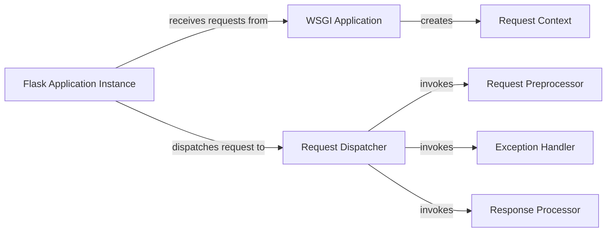

## Component Details

The Request Handling Core is the central part of the Flask application responsible for managing the lifecycle of HTTP requests. It receives requests from a WSGI server, sets up the request context, dispatches the request to the appropriate view function, handles exceptions, and generates responses. The core manages application configuration, context management, and error handling, ensuring a smooth and consistent request processing flow.

### Flask Application Instance
The central Flask application object. It manages the application's configuration, routing, and overall lifecycle. It receives WSGI requests and delegates them to the appropriate handlers.
**Related Classes/Methods**:

- <a href="https://github.com/pallets/flask/blob/master/src/flask/app.py#L904-L920" target="_blank" rel="noopener noreferrer">`src.flask.app.Flask:full_dispatch_request` (904:920)</a>
- <a href="https://github.com/pallets/flask/blob/master/src/flask/app.py#L879-L902" target="_blank" rel="noopener noreferrer">`src.flask.app.Flask:dispatch_request` (879:902)</a>
- <a href="https://github.com/pallets/flask/blob/master/src/flask/app.py#L811-L862" target="_blank" rel="noopener noreferrer">`src.flask.app.Flask:handle_exception` (811:862)</a>
- <a href="https://github.com/pallets/flask/blob/master/src/flask/app.py#L1271-L1296" target="_blank" rel="noopener noreferrer">`src.flask.app.Flask:preprocess_request` (1271:1296)</a>
- <a href="https://github.com/pallets/flask/blob/master/src/flask/app.py#L1298-L1324" target="_blank" rel="noopener noreferrer">`src.flask.app.Flask:process_response` (1298:1324)</a>
- <a href="https://github.com/pallets/flask/blob/master/src/flask/app.py#L1479-L1527" target="_blank" rel="noopener noreferrer">`src.flask.app.Flask:wsgi_app` (1479:1527)</a>
- <a href="https://github.com/pallets/flask/blob/master/src/flask/app.py#L1529-L1536" target="_blank" rel="noopener noreferrer">`src.flask.app.Flask:__call__` (1529:1536)</a>

### WSGI Application
The WSGI application callable. It's the entry point for handling requests from a WSGI server. It sets up the request context and calls the Flask application instance to handle the request.
**Related Classes/Methods**:

- <a href="https://github.com/pallets/flask/blob/master/src/flask/app.py#L1479-L1527" target="_blank" rel="noopener noreferrer">`src.flask.app.Flask:wsgi_app` (1479:1527)</a>

### Request Context
Manages the context for a single request. It stores request-specific information, such as the request object, session, and application context. It's active for the duration of the request.
**Related Classes/Methods**: _None_

### Request Dispatcher
Responsible for dispatching the request to the appropriate view function. It performs URL matching and calls the view function with the request parameters.
**Related Classes/Methods**:

- <a href="https://github.com/pallets/flask/blob/master/src/flask/app.py#L879-L902" target="_blank" rel="noopener noreferrer">`src.flask.app.Flask:dispatch_request` (879:902)</a>
- <a href="https://github.com/pallets/flask/blob/master/src/flask/app.py#L904-L920" target="_blank" rel="noopener noreferrer">`src.flask.app.Flask:full_dispatch_request` (904:920)</a>

### Request Preprocessor
Functions that are executed before the view function is called. They can be used to modify the request or perform authentication/authorization checks.
**Related Classes/Methods**:

- <a href="https://github.com/pallets/flask/blob/master/src/flask/app.py#L1271-L1296" target="_blank" rel="noopener noreferrer">`src.flask.app.Flask:preprocess_request` (1271:1296)</a>

### Response Processor
Functions that are executed after the view function returns. They can be used to modify the response or add headers/cookies.
**Related Classes/Methods**:

- <a href="https://github.com/pallets/flask/blob/master/src/flask/app.py#L1298-L1324" target="_blank" rel="noopener noreferrer">`src.flask.app.Flask:process_response` (1298:1324)</a>

### Exception Handler
Handles exceptions that occur during request processing. It logs the exception and returns an appropriate error response to the client.
**Related Classes/Methods**:

- <a href="https://github.com/pallets/flask/blob/master/src/flask/app.py#L811-L862" target="_blank" rel="noopener noreferrer">`src.flask.app.Flask:handle_exception` (811:862)</a>