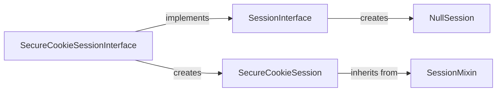

## Component Details

The session management component in Flask provides a mechanism to maintain user-specific data across multiple requests. It revolves around the `SessionInterface` which defines the contract for session implementations. `SecureCookieSessionInterface` is a concrete implementation that uses signed cookies for storing session data securely on the client-side. The `SecureCookieSession` class represents the actual session data stored in the cookie, while `NullSession` is used when sessions are disabled or invalid. The process involves opening a session at the beginning of a request, loading data from the cookie (if it exists), and saving the session data back to the cookie at the end of the request. The `itsdangerous` library is used for cryptographic signing of the cookie to prevent tampering.

### SessionInterface
The SessionInterface defines the interface for implementing session management in Flask. It provides methods for creating null sessions, opening sessions, and saving sessions. It also defines methods for managing cookie parameters such as name, domain, path, and security settings.
**Related Classes/Methods**:

- <a href="https://github.com/pallets/flask/blob/master/src/flask/sessions.py#L114-L284" target="_blank" rel="noopener noreferrer">`src.flask.sessions.SessionInterface` (114:284)</a>
- <a href="https://github.com/pallets/flask/blob/master/src/flask/sessions.py#L185-L187" target="_blank" rel="noopener noreferrer">`src.flask.sessions.SessionInterface.get_cookie_name` (185:187)</a>
- <a href="https://github.com/pallets/flask/blob/master/src/flask/sessions.py#L189-L199" target="_blank" rel="noopener noreferrer">`src.flask.sessions.SessionInterface.get_cookie_domain` (189:199)</a>
- <a href="https://github.com/pallets/flask/blob/master/src/flask/sessions.py#L201-L207" target="_blank" rel="noopener noreferrer">`src.flask.sessions.SessionInterface.get_cookie_path` (201:207)</a>
- <a href="https://github.com/pallets/flask/blob/master/src/flask/sessions.py#L216-L220" target="_blank" rel="noopener noreferrer">`src.flask.sessions.SessionInterface.get_cookie_secure` (216:220)</a>
- <a href="https://github.com/pallets/flask/blob/master/src/flask/sessions.py#L229-L235" target="_blank" rel="noopener noreferrer">`src.flask.sessions.SessionInterface.get_cookie_partitioned` (229:235)</a>
- <a href="https://github.com/pallets/flask/blob/master/src/flask/sessions.py#L222-L227" target="_blank" rel="noopener noreferrer">`src.flask.sessions.SessionInterface.get_cookie_samesite` (222:227)</a>
- <a href="https://github.com/pallets/flask/blob/master/src/flask/sessions.py#L209-L214" target="_blank" rel="noopener noreferrer">`src.flask.sessions.SessionInterface.get_cookie_httponly` (209:214)</a>
- <a href="https://github.com/pallets/flask/blob/master/src/flask/sessions.py#L247-L261" target="_blank" rel="noopener noreferrer">`src.flask.sessions.SessionInterface.should_set_cookie` (247:261)</a>
- <a href="https://github.com/pallets/flask/blob/master/src/flask/sessions.py#L237-L245" target="_blank" rel="noopener noreferrer">`src.flask.sessions.SessionInterface.get_expiration_time` (237:245)</a>

### SecureCookieSessionInterface
The SecureCookieSessionInterface implements session management using secure cookies. It uses a signing serializer to protect the session data from tampering. It interacts with the `SessionInterface` by implementing its methods and uses `itsdangerous` library for secure serialization. It opens and saves sessions using secure cookies.
**Related Classes/Methods**:

- <a href="https://github.com/pallets/flask/blob/master/src/flask/sessions.py#L298-L399" target="_blank" rel="noopener noreferrer">`src.flask.sessions.SecureCookieSessionInterface` (298:399)</a>
- <a href="https://github.com/pallets/flask/blob/master/src/flask/sessions.py#L337-L349" target="_blank" rel="noopener noreferrer">`src.flask.sessions.SecureCookieSessionInterface.open_session` (337:349)</a>
- <a href="https://github.com/pallets/flask/blob/master/src/flask/sessions.py#L351-L399" target="_blank" rel="noopener noreferrer">`src.flask.sessions.SecureCookieSessionInterface.save_session` (351:399)</a>
- <a href="https://github.com/pallets/flask/blob/master/src/flask/sessions.py#L317-L335" target="_blank" rel="noopener noreferrer">`src.flask.sessions.SecureCookieSessionInterface.get_signing_serializer` (317:335)</a>

### NullSession
The NullSession class represents a session that does not store any data. It is used when the session is disabled or when the session data is invalid. It inherits from dict.
**Related Classes/Methods**:

- <a href="https://github.com/pallets/flask/blob/master/src/flask/sessions.py#L97-L111" target="_blank" rel="noopener noreferrer">`src.flask.sessions.NullSession` (97:111)</a>

### SecureCookieSession
The SecureCookieSession class represents a session that is stored in a secure cookie. It inherits from the SessionMixin class and provides methods for accessing and modifying the session data.
**Related Classes/Methods**:

- <a href="https://github.com/pallets/flask/blob/master/src/flask/sessions.py#L52-L94" target="_blank" rel="noopener noreferrer">`src.flask.sessions.SecureCookieSession` (52:94)</a>