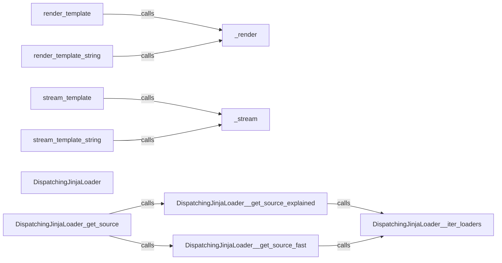

## Component Details

The Template Rendering component in Flask is responsible for generating dynamic web pages by combining templates with data. It uses the Jinja2 templating engine to render templates from the application's template folder or from a string. The component provides functions to render templates and stream templates, both from files and strings. It also includes a custom Jinja2 loader that allows templates to be loaded from various sources.

### render_template
Renders a template from the application's template folder using Jinja2, passing the provided context variables to the template. It returns the rendered HTML as a string.
**Related Classes/Methods**:

- <a href="https://github.com/pallets/flask/blob/master/src/flask/templating.py#L138-L150" target="_blank" rel="noopener noreferrer">`src.flask.templating:render_template` (138:150)</a>

### render_template_string
Renders a template from a string using Jinja2, passing the provided context variables to the template. It returns the rendered HTML as a string.
**Related Classes/Methods**:

- <a href="https://github.com/pallets/flask/blob/master/src/flask/templating.py#L153-L162" target="_blank" rel="noopener noreferrer">`src.flask.templating:render_template_string` (153:162)</a>

### _render
An internal helper function that performs the actual rendering of templates using Jinja2's `render` method. It's used by both `render_template` and `render_template_string`.
**Related Classes/Methods**:

- <a href="https://github.com/pallets/flask/blob/master/src/flask/templating.py#L126-L135" target="_blank" rel="noopener noreferrer">`src.flask.templating:_render` (126:135)</a>

### stream_template
Streams a template from the application's template folder using Jinja2, passing the provided context variables to the template. It returns a response object that streams the rendered HTML.
**Related Classes/Methods**:

- <a href="https://github.com/pallets/flask/blob/master/src/flask/templating.py#L188-L204" target="_blank" rel="noopener noreferrer">`src.flask.templating:stream_template` (188:204)</a>

### stream_template_string
Streams a template from a string using Jinja2, passing the provided context variables to the template. It returns a response object that streams the rendered HTML.
**Related Classes/Methods**:

- <a href="https://github.com/pallets/flask/blob/master/src/flask/templating.py#L207-L219" target="_blank" rel="noopener noreferrer">`src.flask.templating:stream_template_string` (207:219)</a>

### _stream
An internal helper function that performs the actual streaming of templates using Jinja2's `stream` method. It's used by both `stream_template` and `stream_template_string`.
**Related Classes/Methods**:

- <a href="https://github.com/pallets/flask/blob/master/src/flask/templating.py#L165-L185" target="_blank" rel="noopener noreferrer">`src.flask.templating:_stream` (165:185)</a>

### DispatchingJinjaLoader
A custom Jinja2 loader that allows templates to be loaded from different sources based on the template name. It dispatches to different loaders based on the template name, allowing templates to be loaded from various sources.
**Related Classes/Methods**:

- <a href="https://github.com/pallets/flask/blob/master/src/flask/templating.py#L60-L65" target="_blank" rel="noopener noreferrer">`src.flask.templating.DispatchingJinjaLoader:get_source` (60:65)</a>
- <a href="https://github.com/pallets/flask/blob/master/src/flask/templating.py#L67-L89" target="_blank" rel="noopener noreferrer">`src.flask.templating.DispatchingJinjaLoader:_get_source_explained` (67:89)</a>
- <a href="https://github.com/pallets/flask/blob/master/src/flask/templating.py#L91-L99" target="_blank" rel="noopener noreferrer">`src.flask.templating.DispatchingJinjaLoader:_get_source_fast` (91:99)</a>
- <a href="https://github.com/pallets/flask/blob/master/src/flask/templating.py#L101-L109" target="_blank" rel="noopener noreferrer">`src.flask.templating.DispatchingJinjaLoader:_iter_loaders` (101:109)</a>