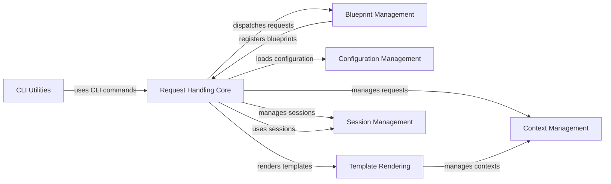

## Component Details

Flask is a micro web framework written in Python. It is designed to be lightweight and flexible, allowing developers to build web applications quickly and easily. The framework provides tools and libraries for handling HTTP requests, routing URLs, rendering templates, managing sessions, and more. Flask is based on Werkzeug WSGI toolkit and Jinja2 template engine.

### Request Handling Core
This component is the heart of the Flask application, responsible for receiving and processing incoming HTTP requests. It manages the application lifecycle, dispatches requests to the appropriate view functions, and generates responses. It also handles application configuration, context management, and error handling.
**Related Classes/Methods**:

- <a href="https://github.com/pallets/flask/blob/master/src/flask/app.py#L904-L920" target="_blank" rel="noopener noreferrer">`src.flask.app.Flask:full_dispatch_request` (904:920)</a>
- <a href="https://github.com/pallets/flask/blob/master/src/flask/app.py#L1479-L1527" target="_blank" rel="noopener noreferrer">`src.flask.app.Flask:wsgi_app` (1479:1527)</a>
- <a href="https://github.com/pallets/flask/blob/master/src/flask/app.py#L1529-L1536" target="_blank" rel="noopener noreferrer">`src.flask.app.Flask:__call__` (1529:1536)</a>
- <a href="https://github.com/pallets/flask/blob/master/src/flask/app.py#L879-L902" target="_blank" rel="noopener noreferrer">`src.flask.app.Flask:dispatch_request` (879:902)</a>
- <a href="https://github.com/pallets/flask/blob/master/src/flask/app.py#L811-L862" target="_blank" rel="noopener noreferrer">`src.flask.app.Flask:handle_exception` (811:862)</a>
- <a href="https://github.com/pallets/flask/blob/master/src/flask/app.py#L1271-L1296" target="_blank" rel="noopener noreferrer">`src.flask.app.Flask:preprocess_request` (1271:1296)</a>
- <a href="https://github.com/pallets/flask/blob/master/src/flask/app.py#L1298-L1324" target="_blank" rel="noopener noreferrer">`src.flask.app.Flask:process_response` (1298:1324)</a>

### Blueprint Management
This component provides a modular way to organize Flask applications. Blueprints allow developers to define reusable sets of routes, templates, and static files. The Blueprint Manager handles blueprint registration, URL rule management, and request handling within the blueprint context, promoting code reusability and maintainability.
**Related Classes/Methods**:

- <a href="https://github.com/pallets/flask/blob/master/src/flask/sansio/blueprints.py#L273-L377" target="_blank" rel="noopener noreferrer">`src.flask.sansio.blueprints.Blueprint:register` (273:377)</a>
- <a href="https://github.com/pallets/flask/blob/master/src/flask/sansio/blueprints.py#L413-L441" target="_blank" rel="noopener noreferrer">`src.flask.sansio.blueprints.Blueprint:add_url_rule` (413:441)</a>

### Configuration Management
This component is responsible for managing the application's configuration settings. It provides methods for loading configuration from various sources, such as files and environment variables. The Configuration Manager allows developers to customize the application's behavior without modifying the code, making it adaptable to different environments.
**Related Classes/Methods**:

- <a href="https://github.com/pallets/flask/blob/master/src/flask/config.py#L102-L124" target="_blank" rel="noopener noreferrer">`src.flask.config.Config:from_envvar` (102:124)</a>
- <a href="https://github.com/pallets/flask/blob/master/src/flask/config.py#L187-L216" target="_blank" rel="noopener noreferrer">`src.flask.config.Config:from_pyfile` (187:216)</a>
- <a href="https://github.com/pallets/flask/blob/master/src/flask/config.py#L256-L302" target="_blank" rel="noopener noreferrer">`src.flask.config.Config:from_file` (256:302)</a>

### Context Management
This component manages the application and request contexts, providing a way to access application-specific and request-specific data within view functions and other parts of the application. The Context Manager ensures that the necessary data is available when needed and cleaned up afterward, maintaining a clean and organized execution environment.
**Related Classes/Methods**:

- <a href="https://github.com/pallets/flask/blob/master/src/flask/ctx.py#L274-L276" target="_blank" rel="noopener noreferrer">`src.flask.ctx.AppContext:__enter__` (274:276)</a>
- <a href="https://github.com/pallets/flask/blob/master/src/flask/ctx.py#L278-L284" target="_blank" rel="noopener noreferrer">`src.flask.ctx.AppContext:__exit__` (278:284)</a>
- <a href="https://github.com/pallets/flask/blob/master/src/flask/ctx.py#L367-L394" target="_blank" rel="noopener noreferrer">`src.flask.ctx.RequestContext:push` (367:394)</a>
- <a href="https://github.com/pallets/flask/blob/master/src/flask/ctx.py#L433-L435" target="_blank" rel="noopener noreferrer">`src.flask.ctx.RequestContext:__enter__` (433:435)</a>
- <a href="https://github.com/pallets/flask/blob/master/src/flask/ctx.py#L437-L443" target="_blank" rel="noopener noreferrer">`src.flask.ctx.RequestContext:__exit__` (437:443)</a>

### Template Rendering
This component handles the rendering of templates, using the Jinja2 templating engine to generate HTML and other output formats. It manages template loading, context management, and rendering, allowing developers to create dynamic web pages by embedding code within templates.
**Related Classes/Methods**:

- <a href="https://github.com/pallets/flask/blob/master/src/flask/templating.py#L60-L65" target="_blank" rel="noopener noreferrer">`src.flask.templating.DispatchingJinjaLoader:get_source` (60:65)</a>
- <a href="https://github.com/pallets/flask/blob/master/src/flask/templating.py#L138-L150" target="_blank" rel="noopener noreferrer">`src.flask.templating:render_template` (138:150)</a>
- <a href="https://github.com/pallets/flask/blob/master/src/flask/templating.py#L153-L162" target="_blank" rel="noopener noreferrer">`src.flask.templating:render_template_string` (153:162)</a>

### Session Management
This component manages user sessions, providing a way to store and retrieve user-specific data across multiple requests. It handles session creation, storage, and retrieval, enabling developers to implement user authentication and authorization features.
**Related Classes/Methods**:

- <a href="https://github.com/pallets/flask/blob/master/src/flask/sessions.py#L164-L174" target="_blank" rel="noopener noreferrer">`src.flask.sessions.SessionInterface:make_null_session` (164:174)</a>
- <a href="https://github.com/pallets/flask/blob/master/src/flask/sessions.py#L337-L349" target="_blank" rel="noopener noreferrer">`src.flask.sessions.SecureCookieSessionInterface:open_session` (337:349)</a>
- <a href="https://github.com/pallets/flask/blob/master/src/flask/sessions.py#L351-L399" target="_blank" rel="noopener noreferrer">`src.flask.sessions.SecureCookieSessionInterface:save_session` (351:399)</a>

### CLI Utilities
This component provides a command-line interface for managing Flask applications. It includes commands for running the development server and performing other administrative tasks. The CLI Utilities component simplifies application management and deployment.
**Related Classes/Methods**:

- <a href="https://github.com/pallets/flask/blob/master/src/flask/cli.py#L41-L91" target="_blank" rel="noopener noreferrer">`src.flask.cli:find_best_app` (41:91)</a>
- <a href="https://github.com/pallets/flask/blob/master/src/flask/cli.py#L230-L232" target="_blank" rel="noopener noreferrer">`src.flask.cli:locate_app` (230:232)</a>
- <a href="https://github.com/pallets/flask/blob/master/src/flask/cli.py#L609-L634" target="_blank" rel="noopener noreferrer">`src.flask.cli.FlaskGroup:get_command` (609:634)</a>
- <a href="https://github.com/pallets/flask/blob/master/src/flask/cli.py#L935-L993" target="_blank" rel="noopener noreferrer">`src.flask.cli:run_command` (935:993)</a>