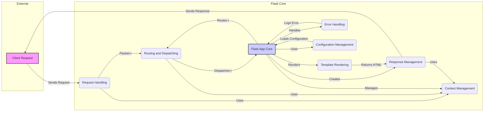

Okay, I'm ready to generate the high-level data flow overview for the Flask project.

**1. Project Description:**

Flask is a lightweight and flexible Python web framework that provides essential tools and features for building web applications. It allows developers to create web applications with minimal boilerplate code, offering features like routing, templating, session management, and more. Flask is designed to be easily extensible, allowing developers to choose the components they need and integrate them seamlessly.

**2. Data Flow Diagram (Mermaid Format):**

**3. Component Descriptions:**

*   **Client Request:** Represents an incoming HTTP request from a client (e.g., a web browser). It initiates the entire Flask application flow by sending a request to the Request Handling component.

*   **Request Handling:** Receives the incoming HTTP request and prepares it for processing. It loads request data, such as form data and URL parameters, and makes it available to other components. It uses Context Management to set up the request context and passes the request to Routing and Dispatching.

*   **Routing and Dispatching:** Matches the URL of the incoming request to a specific view function or handler. It uses Context Management to access the application context and dispatches the request to the appropriate handler within the Flask App Core.

*   **Context Management:** Provides application and request contexts, making application-specific and request-specific data available to other components. It is used by almost all components to maintain state and access resources.

*   **Flask App Core:** The central component of the Flask application, responsible for managing the application lifecycle, handling requests, and coordinating other components. It uses Configuration Management to load settings, Error Handling to manage exceptions, and orchestrates the routing, rendering, and response processes.

*   **Response Management:** Creates and processes HTTP responses, including setting headers, cookies, and the response body. It uses Context Management to access the request context and sends the final response back to the client.

*   **Template Rendering:** Renders templates using Jinja2, generating dynamic HTML content. It is used by the Flask App Core to generate the HTML response based on data and templates. It returns the rendered HTML to Response Management.

*   **Error Handling:** Handles exceptions and errors that occur during request processing. It logs errors and can display custom error pages. It is integrated into the Flask App Core to gracefully handle errors.

*   **Configuration Management:** Loads and manages application configuration from various sources, such as files and environment variables. It provides configuration settings to the Flask App Core, influencing its behavior.