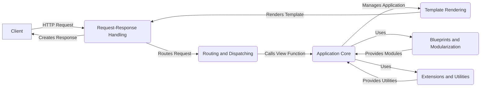

## Flask Data Flow Overview

Flask is a micro web framework written in Python. It is designed to be lightweight and flexible, providing the essentials for building web applications while allowing developers to choose the tools and libraries they want to use. Flask includes a built-in development server and debugger, support for secure cookies, and uses Jinja2 as its templating engine. It is often used for developing small to medium-sized web applications, APIs, and prototypes.

### Component Descriptions:

**Request-Response Handling:** This component receives HTTP requests from the client, encapsulates the request data, and manages the request context. It also creates HTTP responses to be sent back to the client, setting headers and content. It relates to the `Client` by receiving the initial request and sending the final response. It routes the request to `Routing and Dispatching` component.

**Routing and Dispatching:** This component maps incoming requests to the appropriate view functions based on URL rules. It maintains a registry of routes and dispatches requests to the corresponding handlers, managing URL parameters and view arguments. It receives the request from `Request-Response Handling` and calls the `Application Core` to manage the application.

**Application Core:** This component manages the Flask application instance, configuration, and overall lifecycle. It initializes and configures the application, handles context management, and provides access to application-level resources. It is called by `Routing and Dispatching` and uses `Template Rendering`, `Blueprints and Modularization`, and `Extensions and Utilities` to manage the application. It calls `Template Rendering` to render the template.

**Template Rendering:** This component renders templates using Jinja2 to generate dynamic HTML content. It integrates with the Jinja2 templating engine, provides template loading and rendering functions, and manages template context. It is used by `Application Core` to render the template and sends the rendered template back to `Request-Response Handling`.

**Blueprints and Modularization:** This component provides a way to organize Flask applications into reusable components. It allows defining sets of routes, templates, and static files that can be registered with the application, promoting modularity and code reuse. It provides modules to the `Application Core`.

**Extensions and Utilities:** This component offers a collection of helper functions and utilities that extend Flask's functionality. It includes tools for working with sessions, command-line interfaces, testing, and other common tasks. It provides utilities to the `Application Core`.