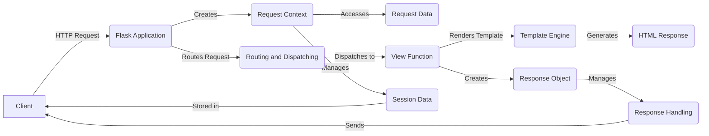

## Flask Data Flow Overview

Flask is a micro web framework written in Python. It is designed to be lightweight and modular, allowing developers to build web applications with flexibility and control. Flask provides tools and libraries for handling HTTP requests, routing URLs, rendering templates, managing sessions, and more.

### Component Descriptions

**Flask Application:** This is the core of the Flask framework. It receives HTTP requests from clients, creates a request context, routes the request to the appropriate view function, and manages the overall application lifecycle. It relates to the `Request Context` by creating it for each request, and to `Routing and Dispatching` by delegating the URL routing.

**Request Context:** This component manages the context of a request, including the request and session objects. It provides access to request data and manages session data. It relates to the `Flask Application` by being created by it, to `Request Data` by providing access to it, and to `Session Data` by managing it.

**Request Data:** This component encapsulates the data sent by the client in the HTTP request, such as form data, query parameters, and headers. It is accessed by the `Request Context` to provide the view function with the necessary information to process the request.

**Routing and Dispatching:** This component handles URL routing, mapping URLs to view functions, and dispatching requests to the appropriate handlers. It receives the request from the `Flask Application` and dispatches it to the appropriate `View Function`.

**View Function:** This is the function that handles the request and generates a response. It can render a template using the `Template Engine` or create a `Response Object` directly.

**Template Engine:** This component renders templates using Jinja2, generating HTML responses. It is used by the `View Function` to generate dynamic content.

**HTML Response:** This is the HTML response generated by the `Template Engine`. It is sent back to the client by the `Response Handling` component.

**Response Object:** This component encapsulates the HTTP response, including the body, headers, and status code. It is created by the `View Function` and managed by the `Response Handling` component.

**Response Handling:** This component manages the creation, processing, and finalization of HTTP responses. It receives the `Response Object` from the `View Function` and sends it back to the client.

**Session Data:** This component manages user session data, typically stored in a cookie. It is managed by the `Request Context` and stored in the client's browser.