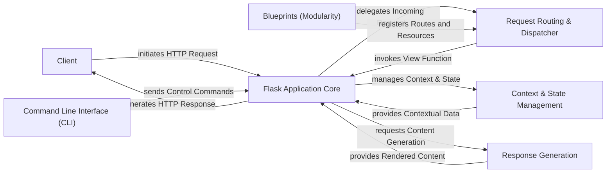

## Details

The Flask application operates around a central `Flask Application Core` that orchestrates the request-response cycle. External `Clients` initiate HTTP requests, which are received by the `Flask Application Core`. The core then delegates these requests to the `Request Routing & Dispatcher` to identify the appropriate view function based on the URL. During request processing, the `Flask Application Core` interacts with `Context & State Management` to manage application and request-specific data, including session information and configuration settings. For generating responses, the `Flask Application Core` requests `Response Generation` to render dynamic content using templates or serve static files. `Blueprints (Modularity)` enhance the application's structure by allowing modular registration of routes and resources with the `Request Routing & Dispatcher`. Finally, the `Command Line Interface (CLI)` provides an external mechanism for sending control commands to the `Flask Application Core`, facilitating management and automation tasks. This architecture emphasizes clear separation of concerns, enabling a modular and maintainable web application.

### Client
Represents external users or systems interacting with the Flask application by sending HTTP requests and receiving responses.

**Related Classes/Methods**:

- <a href="https://github.com/pallets/flask/blob/main/src/flask/app.py" target="_blank" rel="noopener noreferrer">`flask.app`</a>

### Flask Application Core [[Expand]](./Flask_Application_Core.md)
The central orchestrator of the Flask application, managing the overall request-response lifecycle, dispatching requests, and coordinating with other components. It acts as the primary interface for the WSGI server.

**Related Classes/Methods**:

- <a href="https://github.com/pallets/flask/blob/main/src/flask/app.py" target="_blank" rel="noopener noreferrer">`flask.app`</a>

### Request Routing & Dispatcher
Responsible for parsing incoming URLs, matching them against registered rules, and dispatching the request to the correct view function. It manages the URL routing table.

**Related Classes/Methods**:

- <a href="https://github.com/pallets/flask/blob/main/src/flask/sansio/scaffold.py" target="_blank" rel="noopener noreferrer">`flask.sansio.scaffold`</a>

### Context & State Management [[Expand]](./Context_State_Management.md)
Manages the lifecycle of application and request contexts, making request-specific data (like request, session, g) globally accessible. It also handles loading and managing application configuration settings and user sessions.

**Related Classes/Methods**:

- <a href="https://github.com/pallets/flask/blob/main/src/flask/ctx.py" target="_blank" rel="noopener noreferrer">`flask.ctx`</a>
- <a href="https://github.com/pallets/flask/blob/main/src/flask/sessions.py" target="_blank" rel="noopener noreferrer">`flask.sessions`</a>
- <a href="https://github.com/pallets/flask/blob/main/src/flask/config.py" target="_blank" rel="noopener noreferrer">`flask.config`</a>

### Response Generation
Handles the rendering of dynamic content using Jinja2 templates and manages the serving of static assets such as CSS, JavaScript, and images directly from the filesystem.

**Related Classes/Methods**:

- <a href="https://github.com/pallets/flask/blob/main/src/flask/templating.py" target="_blank" rel="noopener noreferrer">`flask.templating`</a>
- <a href="https://github.com/pallets/flask/blob/main/src/flask/helpers.py" target="_blank" rel="noopener noreferrer">`flask.helpers`</a>

### Blueprints (Modularity) [[Expand]](./Blueprints_Modularity_.md)
Provides modularity by registering routes and resources.

**Related Classes/Methods**:

- <a href="https://github.com/pallets/flask/blob/main/src/flask/blueprints.py" target="_blank" rel="noopener noreferrer">`flask.blueprints`</a>

### Command Line Interface (CLI) [[Expand]](./Command_Line_Interface_CLI_.md)
Offers external control and management capabilities for the application.

**Related Classes/Methods**:

- <a href="https://github.com/pallets/flask/blob/main/src/flask/cli.py" target="_blank" rel="noopener noreferrer">`flask.cli`</a>

### [FAQ](https://github.com/CodeBoarding/GeneratedOnBoardings/tree/main?tab=readme-ov-file#faq)