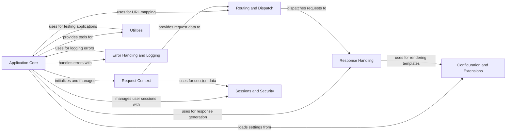

## Component Details

The Flask framework is designed to be a lightweight and extensible web application framework. Its core functionality revolves around request handling, routing, and response generation. The framework provides tools for managing application configuration, user sessions, and security. It also includes utilities for testing and command-line interface management, as well as error handling and logging capabilities. Flask's architecture promotes modularity and allows developers to build web applications with a clear separation of concerns.

### Application Core
The central component responsible for initializing and configuring the Flask application. It manages the application lifecycle, request dispatching, and exception handling. It serves as the entry point for all incoming requests and orchestrates the interaction between other components.
- **Related Classes/Methods**: `flask.src.flask.app.Flask`

### Request Context
This component manages the context for each incoming request, providing access to request-specific data such as the request object, session, and application context. It ensures that this data is available during request processing and cleaned up afterward, maintaining thread safety and isolating requests from each other.
- **Related Classes/Methods**: `flask.src.flask.ctx.AppContext`, `flask.src.flask.ctx.RequestContext`, `flask.src.flask.wrappers.Request`

### Routing and Dispatch
This component maps URLs to view functions and dispatches incoming requests to the appropriate handler based on the requested URL. It defines the URL rules and handles the process of matching URLs to the correct view functions, enabling the application to handle different types of requests and define its API.
- **Related Classes/Methods**: `flask.src.flask.app.Flask`, `src.flask.sansio.scaffold.Scaffold`, `src.flask.sansio.app.App`

### Response Handling
This component is responsible for creating and processing HTTP responses, including setting headers, serializing data (e.g., JSON), and rendering templates. It integrates with the template engine to generate HTML output and provides utilities for creating different types of responses, ensuring that the application's output is correctly formatted and sent to the client.
- **Related Classes/Methods**: `flask.src.flask.app.Flask`, `flask.src.flask.helpers`, `flask.src.flask.json.provider`, `flask.src.flask.templating`

### Configuration and Extensions
This component manages application configuration settings and provides a mechanism for extending Flask's functionality through extensions. It allows you to configure the application using environment variables, Python files, or other sources. Extensions can add new features and integrate with third-party libraries, enhancing the framework's capabilities.
- **Related Classes/Methods**: `flask.src.flask.config.Config`, `flask.src.flask.blueprints.Blueprint`

### Sessions and Security
This component manages user sessions using secure cookies and provides security features such as CSRF protection. It provides a way to store and retrieve user-specific data across multiple requests and ensures the application's security, enabling user authentication and authorization.
- **Related Classes/Methods**: `flask.src.flask.sessions.SessionInterface`, `flask.src.flask.sessions.SecureCookieSessionInterface`

### Utilities
This component provides tools for testing Flask applications and a command-line interface for managing the application. It includes a test client for sending requests to the application and asserting the responses, as well as commands for running the development server and performing other administrative tasks, ensuring the application's quality and ease of use.
- **Related Classes/Methods**: `flask.src.flask.testing.FlaskClient`, `flask.src.flask.testing.FlaskCliRunner`, `flask.src.flask.cli`

### Error Handling and Logging
This component handles exceptions and errors that occur during request processing and provides logging capabilities for Flask applications. It allows you to define custom error handlers for different types of exceptions and log messages to a file, console, or other destination, facilitating debugging and monitoring of the application.
- **Related Classes/Methods**: `flask.src.flask.app.Flask`, `flask.src.flask.logging`