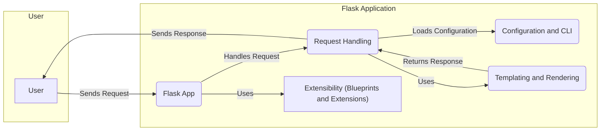

Okay, I will generate an onboarding document for the Flask project based on the provided information.

**1. Project Description**

Flask is a lightweight and flexible Python web framework designed to make getting started with web development quick and easy, with the ability to scale up to complex applications. It provides essential tools and features for building web applications, such as request routing, templating, session management, and more, while leaving room for developers to choose the tools and libraries they prefer. Flask is often referred to as a microframework because it aims to keep the core simple but extensible.

**2. Flow Diagram (Mermaid Format)**

**3. Component Descriptions**

*   **Flask App:** This is the central application object that initializes and manages the Flask application. It's responsible for request routing, middleware execution, and overall application lifecycle management. It receives requests, dispatches them to appropriate handlers, and coordinates the generation of responses.

*   **Request Handling:** This component manages the lifecycle of an HTTP request. It encapsulates the request data, manages user sessions, and provides the application context. It's responsible for processing incoming requests, interacting with the application logic, and preparing responses to be sent back to the client.

*   **Configuration and CLI:** This component handles application configuration, loading settings from various sources like files or environment variables. It also provides a command-line interface for managing the application, such as running the development server or executing administrative tasks.

*   **Templating and Rendering:** This component is responsible for rendering dynamic web pages using Jinja2 templates. It takes data from the application and combines it with templates to generate HTML responses.

*   **Extensibility (Blueprints and Extensions):** This component provides mechanisms for extending Flask's functionality. Blueprints allow you to organize your application into reusable components, while extensions provide a way to integrate third-party libraries and add new features to Flask.
