```mermaid
graph LR
    Flask_Core["Flask Core"]
    Modular_Application_Structure["Modular Application Structure"]
    Templating_Rendering["Templating & Rendering"]
    Session_Data_Management["Session & Data Management"]
    Command_Line_Interface_CLI_["Command Line Interface (CLI)"]
    Testing_Utilities["Testing Utilities"]
    Core_Utilities_Helpers["Core Utilities & Helpers"]
    Core_Utilities_Helpers -- "raises" --> Core_Utilities_Helpers
    Core_Utilities_Helpers -- "uses" --> Core_Utilities_Helpers
    Modular_Application_Structure -- "creates instance of" --> Modular_Application_Structure
    Templating_Rendering -- "delegates source retrieval to" --> Templating_Rendering
    Templating_Rendering -- "iterates loaders and explains via" --> Core_Utilities_Helpers
    Templating_Rendering -- "iterates loaders via" --> Templating_Rendering
    Templating_Rendering -- "renders template via" --> Templating_Rendering
    Templating_Rendering -- "renders template string via" --> Templating_Rendering
    Templating_Rendering -- "streams content using" --> Core_Utilities_Helpers
    Templating_Rendering -- "streams template via" --> Templating_Rendering
    Templating_Rendering -- "streams template string via" --> Templating_Rendering
    Session_Data_Management -- "creates" --> Session_Data_Management
    Session_Data_Management -- "opens session using" --> Session_Data_Management
    Session_Data_Management -- "saves session using" --> Session_Data_Management
    Testing_Utilities -- "initializes with" --> Testing_Utilities
    Testing_Utilities -- "builds request from" --> Testing_Utilities
    Testing_Utilities -- "opens request via" --> Testing_Utilities
    Testing_Utilities -- "invokes CLI via" --> Command_Line_Interface_CLI_
    Flask_Core -- "splits blueprint path using" --> Core_Utilities_Helpers
    Flask_Core -- "loads form data with debug helper" --> Core_Utilities_Helpers
    Command_Line_Interface_CLI_ -- "handles app not found or wrong args via" --> Command_Line_Interface_CLI_
    Command_Line_Interface_CLI_ -- "locates app using" --> Command_Line_Interface_CLI_
    Command_Line_Interface_CLI_ -- "initializes with dotenv helper" --> Core_Utilities_Helpers
    Command_Line_Interface_CLI_ -- "loads app using" --> Command_Line_Interface_CLI_
    Command_Line_Interface_CLI_ -- "gets debug flag from" --> Core_Utilities_Helpers
    Command_Line_Interface_CLI_ -- "registers command with app context" --> Command_Line_Interface_CLI_
    Command_Line_Interface_CLI_ -- "loads dotenv via" --> Command_Line_Interface_CLI_
    Command_Line_Interface_CLI_ -- "gets command by loading plugin commands from" --> Command_Line_Interface_CLI_
    Command_Line_Interface_CLI_ -- "lists commands by loading plugin commands from" --> Command_Line_Interface_CLI_
    Command_Line_Interface_CLI_ -- "makes context using" --> Command_Line_Interface_CLI_
    Command_Line_Interface_CLI_ -- "runs command using" --> Command_Line_Interface_CLI_
    Flask_Core -- "pushes context on enter" --> Flask_Core
    Flask_Core -- "pops context on exit" --> Flask_Core
    Flask_Core -- "creates copy of" --> Flask_Core
    Flask_Core -- "pushes context and matches request" --> Flask_Core
    Core_Utilities_Helpers -- "loads from envvar via" --> Core_Utilities_Helpers
    Core_Utilities_Helpers -- "loads from pyfile via" --> Core_Utilities_Helpers
    Core_Utilities_Helpers -- "loads from file via" --> Core_Utilities_Helpers
    Flask_Core -- "initializes with" --> Flask_Core
    Flask_Core -- "initializes with" --> Command_Line_Interface_CLI_
    Flask_Core -- "sends static file using" --> Core_Utilities_Helpers
    Flask_Core -- "creates" --> Templating_Rendering
    Flask_Core -- "raises routing exception via" --> Core_Utilities_Helpers
    Flask_Core -- "updates template context via" --> Flask_Core
    Flask_Core -- "runs using" --> Core_Utilities_Helpers
    Flask_Core -- "runs using" --> Command_Line_Interface_CLI_
    Flask_Core -- "handles http exception via" --> Flask_Core
    Flask_Core -- "handles user exception via" --> Flask_Core
    Flask_Core -- "handles exception via" --> Flask_Core
    Flask_Core -- "dispatches request via" --> Flask_Core
    Flask_Core -- "fully dispatches request via" --> Flask_Core
    Flask_Core -- "finalizes request via" --> Flask_Core
    Flask_Core -- "makes default response using" --> Flask_Core
    Flask_Core -- "ensures sync via" --> Flask_Core
    Flask_Core -- "generates URL for" --> Flask_Core
    Flask_Core -- "makes response using" --> Flask_Core
    Flask_Core -- "makes response using" --> Session_Data_Management
    Flask_Core -- "preprocesses request via" --> Flask_Core
    Flask_Core -- "processes response via" --> Flask_Core
    Flask_Core -- "processes response via" --> Session_Data_Management
    Flask_Core -- "tears down request via" --> Flask_Core
    Flask_Core -- "tears down app context via" --> Flask_Core
    Flask_Core -- "creates" --> Flask_Core
    Flask_Core -- "creates test request context using" --> Testing_Utilities
    Flask_Core -- "creates test request context using" --> Flask_Core
    Flask_Core -- "serves WSGI app via" --> Flask_Core
    Flask_Core -- "calls" --> Flask_Core
    Core_Utilities_Helpers -- "creates logger using" --> Core_Utilities_Helpers
    Modular_Application_Structure -- "initializes with" --> Flask_Core
    Modular_Application_Structure -- "initializes with" --> Command_Line_Interface_CLI_
    Modular_Application_Structure -- "sends static file using" --> Core_Utilities_Helpers
    Core_Utilities_Helpers -- "streams with context via" --> Core_Utilities_Helpers
    Core_Utilities_Helpers -- "sends file via" --> Core_Utilities_Helpers
    Core_Utilities_Helpers -- "sends from directory via" --> Core_Utilities_Helpers
    Core_Utilities_Helpers -- "splits blueprint path via" --> Core_Utilities_Helpers
    Flask_Core -- "routes method via" --> Flask_Core
    Flask_Core -- "handles GET via" --> Flask_Core
    Flask_Core -- "handles POST via" --> Flask_Core
    Flask_Core -- "handles PUT via" --> Flask_Core
    Flask_Core -- "handles DELETE via" --> Flask_Core
    Flask_Core -- "handles PATCH via" --> Flask_Core
    Flask_Core -- "adds URL rule via" --> Flask_Core
    Flask_Core -- "registers error handler via" --> Flask_Core
    Flask_Core -- "registers error handler by getting exception class and code from" --> Flask_Core
    Flask_Core -- "finds package via" --> Flask_Core
    Flask_Core -- "initializes app via" --> Flask_Core
    Flask_Core -- "creates Jinja environment via" --> Flask_Core
    Flask_Core -- "adds template filter via" --> Flask_Core
    Flask_Core -- "adds template test via" --> Flask_Core
    Flask_Core -- "adds template global via" --> Flask_Core
    Flask_Core -- "records once via" --> Flask_Core
    Flask_Core -- "makes setup state via" --> Flask_Core
    Flask_Core -- "registers blueprint via" --> Flask_Core
    Flask_Core -- "merges blueprint functions via" --> Flask_Core
    Flask_Core -- "adds app template filter via" --> Flask_Core
    Flask_Core -- "adds app template filter by recording once via" --> Flask_Core
    Session_Data_Management -- "tags JSON via" --> Session_Data_Management
    Session_Data_Management -- "initializes by registering" --> Session_Data_Management
    Session_Data_Management -- "untags scan via" --> Session_Data_Management
    Session_Data_Management -- "dumps JSON via" --> Session_Data_Management
    Session_Data_Management -- "loads JSON via" --> Session_Data_Management
    Session_Data_Management -- "dumps via" --> Session_Data_Management
    Session_Data_Management -- "loads via" --> Session_Data_Management
    Session_Data_Management -- "prepares response and dumps via" --> Session_Data_Management
    Session_Data_Management -- "prepares default response and dumps via" --> Session_Data_Management
    click Flask_Core href "https://github.com/CodeBoarding/GeneratedOnBoardings/blob/main/flask/Flask Core.md" "Details"
    click Modular_Application_Structure href "https://github.com/CodeBoarding/GeneratedOnBoardings/blob/main/flask/Modular Application Structure.md" "Details"
    click Templating_Rendering href "https://github.com/CodeBoarding/GeneratedOnBoardings/blob/main/flask/Templating & Rendering.md" "Details"
    click Session_Data_Management href "https://github.com/CodeBoarding/GeneratedOnBoardings/blob/main/flask/Session & Data Management.md" "Details"
    click Command_Line_Interface_CLI_ href "https://github.com/CodeBoarding/GeneratedOnBoardings/blob/main/flask/Command Line Interface (CLI).md" "Details"
    click Testing_Utilities href "https://github.com/CodeBoarding/GeneratedOnBoardings/blob/main/flask/Testing Utilities.md" "Details"
    click Core_Utilities_Helpers href "https://github.com/CodeBoarding/GeneratedOnBoardings/blob/main/flask/Core Utilities & Helpers.md" "Details"
```

## Component Details

The Flask framework's architecture is centered around a robust core that manages the HTTP request-response lifecycle, application and request contexts, and low-level sans-I/O operations. It supports modular application development through Blueprints and a flexible View System for defining endpoints. Templating and rendering are handled by a dedicated engine, while session management and JSON serialization facilitate data handling. A comprehensive Command Line Interface (CLI) provides development and deployment utilities, complemented by a Testing Utilities component for robust application testing. Various Core Utilities & Helpers provide essential services like debugging, configuration, logging, and general-purpose functions.

### Flask Core
Manages the central application lifecycle, including request handling, routing, error management, WSGI integration, and provides mechanisms for managing application and request contexts. It also encompasses the low-level sans-I/O components for routing and error handling.

**Related Classes/Methods**:

- <a href="https://github.com/pallets/flask/blob/master/src/flask/app.py#L226-L279" target="_blank" rel="noopener noreferrer">`flask.src.flask.app.Flask:__init__` (226:279)</a>
- <a href="https://github.com/pallets/flask/blob/master/src/flask/app.py#L546-L667" target="_blank" rel="noopener noreferrer">`flask.src.flask.app.Flask:run` (546:667)</a>
- <a href="https://github.com/pallets/flask/blob/master/src/flask/app.py#L744-L777" target="_blank" rel="noopener noreferrer">`flask.src.flask.app.Flask:handle_http_exception` (744:777)</a>
- <a href="https://github.com/pallets/flask/blob/master/src/flask/app.py#L779-L809" target="_blank" rel="noopener noreferrer">`flask.src.flask.app.Flask:handle_user_exception` (779:809)</a>
- <a href="https://github.com/pallets/flask/blob/master/src/flask/app.py#L811-L862" target="_blank" rel="noopener noreferrer">`flask.src.flask.app.Flask:handle_exception` (811:862)</a>
- <a href="https://github.com/pallets/flask/blob/master/src/flask/app.py#L879-L902" target="_blank" rel="noopener noreferrer">`flask.src.flask.app.Flask:dispatch_request` (879:902)</a>
- <a href="https://github.com/pallets/flask/blob/master/src/flask/app.py#L904-L920" target="_blank" rel="noopener noreferrer">`flask.src.flask.app.Flask:full_dispatch_request` (904:920)</a>
- <a href="https://github.com/pallets/flask/blob/master/src/flask/app.py#L922-L951" target="_blank" rel="noopener noreferrer">`flask.src.flask.app.Flask:finalize_request` (922:951)</a>
- <a href="https://github.com/pallets/flask/blob/master/src/flask/app.py#L1129-L1269" target="_blank" rel="noopener noreferrer">`flask.src.flask.app.Flask:make_response` (1129:1269)</a>
- <a href="https://github.com/pallets/flask/blob/master/src/flask/app.py#L1271-L1296" target="_blank" rel="noopener noreferrer">`flask.src.flask.app.Flask:preprocess_request` (1271:1296)</a>
- <a href="https://github.com/pallets/flask/blob/master/src/flask/app.py#L1298-L1324" target="_blank" rel="noopener noreferrer">`flask.src.flask.app.Flask:process_response` (1298:1324)</a>
- <a href="https://github.com/pallets/flask/blob/master/src/flask/app.py#L1326-L1358" target="_blank" rel="noopener noreferrer">`flask.src.flask.app.Flask:do_teardown_request` (1326:1358)</a>
- <a href="https://github.com/pallets/flask/blob/master/src/flask/app.py#L1360-L1384" target="_blank" rel="noopener noreferrer">`flask.src.flask.app.Flask:do_teardown_appcontext` (1360:1384)</a>
- <a href="https://github.com/pallets/flask/blob/master/src/flask/app.py#L1386-L1405" target="_blank" rel="noopener noreferrer">`flask.src.flask.app.Flask:app_context` (1386:1405)</a>
- <a href="https://github.com/pallets/flask/blob/master/src/flask/app.py#L1407-L1421" target="_blank" rel="noopener noreferrer">`flask.src.flask.app.Flask:request_context` (1407:1421)</a>
- <a href="https://github.com/pallets/flask/blob/master/src/flask/app.py#L1423-L1477" target="_blank" rel="noopener noreferrer">`flask.src.flask.app.Flask:test_request_context` (1423:1477)</a>
- <a href="https://github.com/pallets/flask/blob/master/src/flask/app.py#L1479-L1527" target="_blank" rel="noopener noreferrer">`flask.src.flask.app.Flask:wsgi_app` (1479:1527)</a>
- <a href="https://github.com/pallets/flask/blob/master/src/flask/app.py#L1529-L1536" target="_blank" rel="noopener noreferrer">`flask.src.flask.app.Flask:__call__` (1529:1536)</a>
- <a href="https://github.com/pallets/flask/blob/master/src/flask/ctx.py#L274-L276" target="_blank" rel="noopener noreferrer">`flask.src.flask.ctx.AppContext:__enter__` (274:276)</a>
- <a href="https://github.com/pallets/flask/blob/master/src/flask/ctx.py#L251-L254" target="_blank" rel="noopener noreferrer">`flask.src.flask.ctx.AppContext:push` (251:254)</a>
- <a href="https://github.com/pallets/flask/blob/master/src/flask/ctx.py#L278-L284" target="_blank" rel="noopener noreferrer">`flask.src.flask.ctx.AppContext:__exit__` (278:284)</a>
- <a href="https://github.com/pallets/flask/blob/master/src/flask/ctx.py#L256-L272" target="_blank" rel="noopener noreferrer">`flask.src.flask.ctx.AppContext:pop` (256:272)</a>
- <a href="https://github.com/pallets/flask/blob/master/src/flask/ctx.py#L337-L355" target="_blank" rel="noopener noreferrer">`flask.src.flask.ctx.RequestContext:copy` (337:355)</a>
- <a href="https://github.com/pallets/flask/blob/master/src/flask/ctx.py#L367-L394" target="_blank" rel="noopener noreferrer">`flask.src.flask.ctx.RequestContext:push` (367:394)</a>
- <a href="https://github.com/pallets/flask/blob/master/src/flask/ctx.py#L357-L365" target="_blank" rel="noopener noreferrer">`flask.src.flask.ctx.RequestContext:match_request` (357:365)</a>
- <a href="https://github.com/pallets/flask/blob/master/src/flask/ctx.py#L433-L435" target="_blank" rel="noopener noreferrer">`flask.src.flask.ctx.RequestContext:__enter__` (433:435)</a>
- <a href="https://github.com/pallets/flask/blob/master/src/flask/ctx.py#L437-L443" target="_blank" rel="noopener noreferrer">`flask.src.flask.ctx.RequestContext:__exit__` (437:443)</a>

### Modular Application Structure
Provides mechanisms for organizing Flask applications into reusable and modular components (Blueprints) and defines base classes and utilities for creating view functions and class-based views.

**Related Classes/Methods**:

- <a href="https://github.com/pallets/flask/blob/master/src/flask/blueprints.py#L19-L53" target="_blank" rel="noopener noreferrer">`flask.src.flask.blueprints.Blueprint:__init__` (19:53)</a>

### Templating & Rendering
Integrates Jinja2 for rendering HTML templates, handling template loading, processing with context data, and streaming output.

**Related Classes/Methods**:

- <a href="https://github.com/pallets/flask/blob/master/src/flask/templating.py#L60-L65" target="_blank" rel="noopener noreferrer">`flask.src.flask.templating.DispatchingJinjaLoader:get_source` (60:65)</a>
- <a href="https://github.com/pallets/flask/blob/master/src/flask/templating.py#L67-L89" target="_blank" rel="noopener noreferrer">`flask.src.flask.templating.DispatchingJinjaLoader._get_source_explained` (67:89)</a>
- <a href="https://github.com/pallets/flask/blob/master/src/flask/templating.py#L101-L109" target="_blank" rel="noopener noreferrer">`flask.src.flask.templating.DispatchingJinjaLoader._iter_loaders` (101:109)</a>
- <a href="https://github.com/pallets/flask/blob/master/src/flask/templating.py#L91-L99" target="_blank" rel="noopener noreferrer">`flask.src.flask.templating.DispatchingJinjaLoader._get_source_fast` (91:99)</a>
- <a href="https://github.com/pallets/flask/blob/master/src/flask/templating.py#L138-L150" target="_blank" rel="noopener noreferrer">`flask.src.flask.templating:render_template` (138:150)</a>
- <a href="https://github.com/pallets/flask/blob/master/src/flask/templating.py#L126-L135" target="_blank" rel="noopener noreferrer">`flask.src.flask.templating._render` (126:135)</a>
- <a href="https://github.com/pallets/flask/blob/master/src/flask/templating.py#L153-L162" target="_blank" rel="noopener noreferrer">`flask.src.flask.templating:render_template_string` (153:162)</a>
- <a href="https://github.com/pallets/flask/blob/master/src/flask/templating.py#L165-L185" target="_blank" rel="noopener noreferrer">`flask.src.flask.templating._stream` (165:185)</a>
- <a href="https://github.com/pallets/flask/blob/master/src/flask/templating.py#L188-L204" target="_blank" rel="noopener noreferrer">`flask.src.flask.templating:stream_template` (188:204)</a>
- <a href="https://github.com/pallets/flask/blob/master/src/flask/templating.py#L207-L219" target="_blank" rel="noopener noreferrer">`flask.src.flask.templating:stream_template_string` (207:219)</a>

### Session & Data Management
Provides an interface for managing user sessions, typically using secure cookies, and offers utilities for encoding and decoding Python objects to and from JSON format.

**Related Classes/Methods**:

- <a href="https://github.com/pallets/flask/blob/master/src/flask/sessions.py#L164-L174" target="_blank" rel="noopener noreferrer">`flask.src.flask.sessions.SessionInterface:make_null_session` (164:174)</a>
- <a href="https://github.com/pallets/flask/blob/master/src/flask/sessions.py#L337-L349" target="_blank" rel="noopener noreferrer">`flask.src.flask.sessions.SecureCookieSessionInterface:open_session` (337:349)</a>
- <a href="https://github.com/pallets/flask/blob/master/src/flask/sessions.py#L351-L399" target="_blank" rel="noopener noreferrer">`flask.src.flask.sessions.SecureCookieSessionInterface:save_session` (351:399)</a>
- <a href="https://github.com/pallets/flask/blob/master/src/flask/json/tag.py#L321-L323" target="_blank" rel="noopener noreferrer">`flask.src.flask.json.tag.TaggedJSONSerializer:dumps` (321:323)</a>
- <a href="https://github.com/pallets/flask/blob/master/src/flask/json/tag.py#L325-L327" target="_blank" rel="noopener noreferrer">`flask.src.flask.json.tag.TaggedJSONSerializer:loads` (325:327)</a>

### Command Line Interface (CLI)
Implements Flask's command-line interface, enabling developers to run the development server, manage application instances, and execute custom commands.

**Related Classes/Methods**:

- <a href="https://github.com/pallets/flask/blob/master/src/flask/cli.py#L41-L91" target="_blank" rel="noopener noreferrer">`flask.src.flask.cli:find_best_app` (41:91)</a>
- <a href="https://github.com/pallets/flask/blob/master/src/flask/cli.py#L120-L197" target="_blank" rel="noopener noreferrer">`flask.src.flask.cli:find_app_by_string` (120:197)</a>
- <a href="https://github.com/pallets/flask/blob/master/src/flask/cli.py#L230-L232" target="_blank" rel="noopener noreferrer">`flask.src.flask.cli:locate_app` (230:232)</a>
- <a href="https://github.com/pallets/flask/blob/master/src/flask/cli.py#L333-L372" target="_blank" rel="noopener noreferrer">`flask.src.flask.cli.ScriptInfo:load_app` (333:372)</a>
- <a href="https://github.com/pallets/flask/blob/master/src/flask/cli.py#L413-L427" target="_blank" rel="noopener noreferrer">`flask.src.flask.cli.AppGroup:command` (413:427)</a>
- <a href="https://github.com/pallets/flask/blob/master/src/flask/cli.py#L380-L402" target="_blank" rel="noopener noreferrer">`flask.src.flask.cli.with_appcontext` (380:402)</a>
- <a href="https://github.com/pallets/flask/blob/master/src/flask/cli.py#L698-L763" target="_blank" rel="noopener noreferrer">`flask.src.flask.cli.load_dotenv` (698:763)</a>
- <a href="https://github.com/pallets/flask/blob/master/src/flask/cli.py#L609-L634" target="_blank" rel="noopener noreferrer">`flask.src.flask.cli.FlaskGroup:get_command` (609:634)</a>
- <a href="https://github.com/pallets/flask/blob/master/src/flask/cli.py#L636-L655" target="_blank" rel="noopener noreferrer">`flask.src.flask.cli.FlaskGroup:list_commands` (636:655)</a>
- <a href="https://github.com/pallets/flask/blob/master/src/flask/cli.py#L657-L676" target="_blank" rel="noopener noreferrer">`flask.src.flask.cli.FlaskGroup:make_context` (657:676)</a>
- <a href="https://github.com/pallets/flask/blob/master/src/flask/cli.py#L935-L993" target="_blank" rel="noopener noreferrer">`flask.src.flask.cli.run_command` (935:993)</a>

### Testing Utilities
Provides a set of tools and classes for writing unit and integration tests for Flask applications, including a test client to simulate requests and a CLI runner for testing command-line interactions.

**Related Classes/Methods**:

- <a href="https://github.com/pallets/flask/blob/master/src/flask/testing.py#L125-L133" target="_blank" rel="noopener noreferrer">`flask.src.flask.testing.FlaskClient:__init__` (125:133)</a>

### Core Utilities & Helpers
A collection of miscellaneous utility functions used throughout the Flask framework, including file serving, context streaming, environment variable loading, debugging aids, error handling helpers, configuration management, and basic logging setup.

**Related Classes/Methods**:

- <a href="https://github.com/pallets/flask/blob/master/src/flask/debughelpers.py#L81-L104" target="_blank" rel="noopener noreferrer">`flask.src.flask.debughelpers:attach_enctype_error_multidict` (81:104)</a>
- <a href="https://github.com/pallets/flask/blob/master/src/flask/debughelpers.py#L124-L178" target="_blank" rel="noopener noreferrer">`flask.src.flask.debughelpers:explain_template_loading_attempts` (124:178)</a>
- <a href="https://github.com/pallets/flask/blob/master/src/flask/helpers.py#L51-L53" target="_blank" rel="noopener noreferrer">`flask.src.flask.helpers:stream_with_context` (51:53)</a>
- <a href="https://github.com/pallets/flask/blob/master/src/flask/helpers.py#L400-L523" target="_blank" rel="noopener noreferrer">`flask.src.flask.helpers:send_file` (400:523)</a>
- <a href="https://github.com/pallets/flask/blob/master/src/flask/helpers.py#L526-L567" target="_blank" rel="noopener noreferrer">`flask.src.flask.helpers:send_from_directory` (526:567)</a>

### [FAQ](https://github.com/CodeBoarding/GeneratedOnBoardings/tree/main?tab=readme-ov-file#faq)