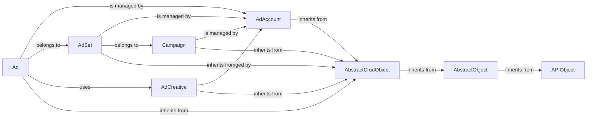

## Component Details

The Ad Object Management component provides a structured way to interact with Facebook's advertising platform. It defines classes representing key ad objects like Ads, Ad Accounts, Ad Sets, Campaigns, and Ad Creatives. These classes inherit from base classes that handle API communication and data manipulation, offering a consistent interface for creating, reading, updating, and deleting ad objects. The component simplifies ad campaign management by encapsulating the complexities of the Facebook Ads API.

### Ad
Represents a Facebook Ad. It allows for creation, deletion, retrieval, and updating of ad objects. It also provides methods for accessing related entities like ad creatives, insights, and leads.
- **Related Classes/Methods**: `facebook_business.adobjects.ad.Ad`

### AdAccount
Represents a Facebook Ad Account. It provides methods for managing ad accounts, including creating and retrieving ads, ad sets, campaigns, creatives, and insights. It also handles user management and other account-level operations.
- **Related Classes/Methods**: `facebook_business.adobjects.adaccount.AdAccount`

### AdSet
Represents a Facebook Ad Set. It allows for creation, deletion, retrieval, and updating of ad sets. It also provides methods for accessing related entities like ads, activities, and insights.
- **Related Classes/Methods**: `facebook_business.adobjects.adset.AdSet`

### Campaign
Represents a Facebook Campaign. It allows for creation, deletion, retrieval, and updating of campaigns. It also provides methods for accessing related entities like ads, ad sets, and insights.
- **Related Classes/Methods**: `facebook_business.adobjects.campaign.Campaign`

### AdCreative
Represents a Facebook Ad Creative. It allows for creation, deletion, retrieval, and updating of ad creatives. It also provides methods for accessing creative insights and previews.
- **Related Classes/Methods**: `facebook_business.adobjects.adcreative.AdCreative`

### AbstractCrudObject
The base class for objects that support CRUD operations (Create, Read, Update, Delete). It provides a common interface for interacting with the Facebook Ads API for managing ad objects.
- **Related Classes/Methods**: `facebook_business.adobjects.abstractcrudobject.AbstractCrudObject`

### AbstractObject
The base class for all Facebook Ad objects. It provides common functionality for accessing and manipulating object data, such as retrieving fields, updating properties, and making API calls.
- **Related Classes/Methods**: `facebook_business.adobjects.abstractobject.AbstractObject`

### APIObject
The base class for all API objects. It provides common functionality for making API calls to the Facebook Ads API.
- **Related Classes/Methods**: `facebook_business.api.objects.APIObject`
