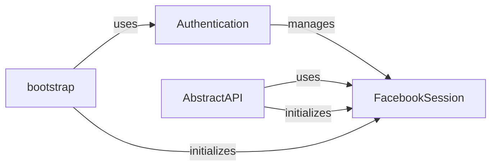

## Component Details

The Authentication and Session Management subsystem is responsible for securely authenticating users and managing their sessions when interacting with the Facebook Marketing API. It handles the OAuth flow, obtains and refreshes access tokens, and provides a persistent session for API requests. This ensures that only authorized users can access the API and that their sessions are maintained across multiple requests.

### FacebookSession
The FacebookSession class manages the user's session with the Facebook API. It stores the access token, API version, and other session-related information. It provides methods for accessing and refreshing the access token, ensuring that the session remains valid. It interacts with the AbstractAPI class to provide the access token for API requests and with the Authentication class to refresh the token when necessary.
- **Related Classes/Methods**: `facebook_business.session.FacebookSession`

### Authentication
The Authentication class handles the OAuth authentication flow. It obtains the access token from Facebook using the user's credentials and permissions. It also provides methods for refreshing the access token when it expires. It interacts with the FacebookSession class to store the access token and with the bootstrap module to initiate the authentication process.
- **Related Classes/Methods**: `facebook_business.bootstrap.Authentication`

### AbstractAPI
The AbstractAPI class provides a base class for interacting with the Facebook API. It handles common tasks such as making API requests, handling responses, and managing errors. It uses the FacebookSession class to obtain the access token for API requests. All API calls are routed through this class.
- **Related Classes/Methods**: `facebook_business.api.AbstractAPI`

### bootstrap
The bootstrap module serves as the entry point for initiating the authentication process. It orchestrates the authentication flow by using the Authentication class and FacebookSession. It initializes the FacebookSession and Authentication objects and provides a simple interface for developers to authenticate their applications.
- **Related Classes/Methods**: `facebook_business.bootstrap`
