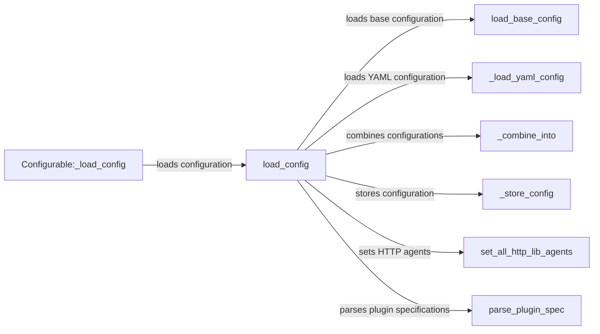

## Component Details

The Configuration Management component in garak is responsible for loading, validating, and providing access to configuration settings. It orchestrates the loading of default configurations, merging user-defined configurations from YAML files, environment variables, and command-line arguments, and validating the final configuration. This ensures that all other components have consistent and reliable access to the settings they need to operate correctly, centralizing the management of application-wide parameters.

### load_config
This function serves as the main entry point for loading the application's configuration. It orchestrates the loading of base configurations, merging of user-defined configurations, and validation of the final configuration, and sets up HTTP client user agents.
- **Related Classes/Methods**: `garak.garak._config:load_config`

### load_base_config
This function loads the default or base configuration settings for the application. These settings provide a baseline for the application's behavior.
- **Related Classes/Methods**: `garak.garak._config:load_base_config`

### _load_yaml_config
This function loads configuration settings from a YAML file. It parses the YAML file and converts it into a Python dictionary or object.
- **Related Classes/Methods**: `garak.garak._config:_load_yaml_config`

### _combine_into
This function merges multiple configuration sources into a single configuration object. It handles potential conflicts and prioritizes configuration values based on a predefined order.
- **Related Classes/Methods**: `garak.garak._config:_combine_into`

### _store_config
This function stores the loaded configuration in a central location, making it accessible to other parts of the application.
- **Related Classes/Methods**: `garak.garak._config:_store_config`

### set_all_http_lib_agents
This function configures the HTTP client libraries with specific user agents. This is important for identifying the application when making HTTP requests.
- **Related Classes/Methods**: `garak.garak._config:set_all_http_lib_agents`

### parse_plugin_spec
This function parses the plugin specifications from the configuration. It extracts information about the plugins to be loaded and their configuration settings.
- **Related Classes/Methods**: `garak.garak._config:parse_plugin_spec`

### Configurable:_load_config
This function is responsible for loading configuration specific to Configurable objects. It likely retrieves relevant configuration sections and applies them to the object's attributes.
- **Related Classes/Methods**: `garak.garak.configurable.Configurable:_load_config`
