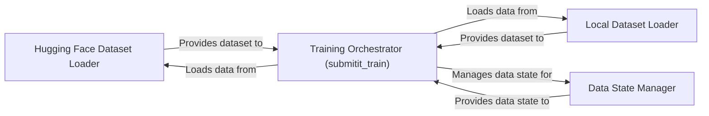

## Component Details

The Data Management component is responsible for handling the data pipeline in the flow matching project. It encompasses loading datasets from Hugging Face or local sources, preprocessing the data, and preparing it for training and evaluation. The component ensures efficient data flow by managing data iterators and dataset states, and it integrates with the training loop orchestrated by the main function.

### Hugging Face Dataset Loader
This component is responsible for loading datasets from the Hugging Face datasets library. It abstracts away the complexities of interacting with the library and provides a standardized interface for accessing various datasets. It handles dataset-specific configurations and preprocessing steps required for the flow matching model.
- **Related Classes/Methods**: `flow_matching.examples.text.data.data:_get_hf_dataset`

### Local Dataset Loader
This component handles loading datasets from local sources or generating them. It provides flexibility to use custom datasets or generate synthetic data. It also handles data loading, preprocessing, and splitting into training and validation sets.
- **Related Classes/Methods**: `flow_matching.examples.text.data.data:_get_dataset`

### Data State Manager
This component determines the state or properties of the dataset. This could involve calculating statistics, checking data types, or verifying the integrity of the data. It ensures that the data is in the expected format and range before being fed into the model.
- **Related Classes/Methods**: `flow_matching.examples.text.data.data:get_data_state`

### Training Orchestrator (submitit_train)
This component is the main function for training the flow matching model using the submitit job scheduler. It orchestrates the data loading, model initialization, training loop, and evaluation. This component ties together the data loading, model training, and evaluation processes.
- **Related Classes/Methods**: `flow_matching.examples.image.submitit_train:main`
