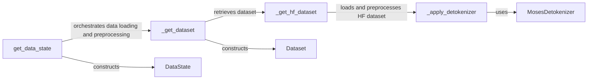

## Component Details

### get_data_state
The `get_data_state` function serves as the entry point for the data loading and preprocessing pipeline. It orchestrates the retrieval of the dataset by calling `_get_dataset` based on the provided configuration and constructs a `DataState` object, which encapsulates the dataset and any associated metadata. This function abstracts the complexities of data handling, providing a consistent interface for accessing preprocessed data.
- **Related Classes/Methods**: `repos.flow_matching.examples.text.data.data:get_data_state`

### _get_dataset
The `_get_dataset` function is responsible for retrieving the actual dataset. It determines whether to load a Hugging Face dataset using `_get_hf_dataset` or to utilize a custom dataset implementation. The function returns a `Dataset` object, which provides methods for accessing individual data samples.
- **Related Classes/Methods**: `repos.flow_matching.examples.text.data.data:_get_dataset`

### _get_hf_dataset
The `_get_hf_dataset` function specifically handles the loading of datasets from the Hugging Face datasets library. It loads the dataset and applies detokenization using `_apply_detokenizer` if specified in the configuration. This function leverages the `datasets` library to efficiently load and preprocess large datasets.
- **Related Classes/Methods**: `repos.flow_matching.examples.text.data.data:_get_hf_dataset`

### _apply_detokenizer
The `_apply_detokenizer` function is responsible for applying a detokenizer to the text data within the dataset. It uses the `moses_detokenizer` if specified to convert tokenized text back into a more human-readable format. This step is crucial for tasks that require generating or interpreting natural language.
- **Related Classes/Methods**: `repos.flow_matching.examples.text.data.data:_get_hf_dataset._apply_detokenizer`

### MosesDetokenizer
The `MosesDetokenizer` class provides functionality for detokenizing text using the Moses detokenizer. It takes tokenized text as input and returns detokenized text, effectively reversing the tokenization process. This component is used within the `_apply_detokenizer` function to improve the readability of text data.
- **Related Classes/Methods**: `repos.flow_matching.examples.text.data.data._get_hf_dataset._apply_detokenizer.detok`

### Dataset
The `Dataset` class represents the dataset itself and provides methods for accessing individual data samples. It encapsulates the data and any associated metadata, offering a consistent interface for iterating through the dataset and retrieving data points. This class is a core component of the data pipeline, providing the raw data to subsequent processing steps.
- **Related Classes/Methods**: `repos.flow_matching.examples.text.data.data.Dataset`

### DataState
The `DataState` class encapsulates the state of the data after it has been loaded and preprocessed. It contains the dataset, along with any relevant metadata, such as the tokenizer used. This class serves as the final output of the data pipeline, providing a convenient way to access the prepared data for use in downstream tasks.
- **Related Classes/Methods**: `repos.flow_matching.examples.text.data.data.DataState`
