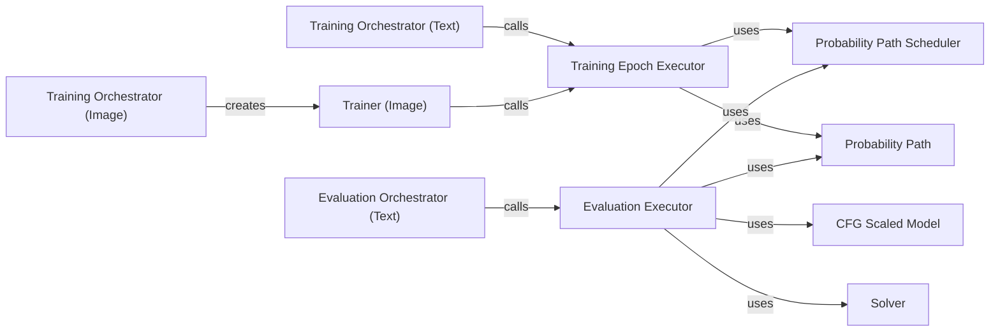

## Component Details

### Training Orchestrator (Text)
The Training Orchestrator for text-based models manages the entire training process. It encompasses setup, the execution of the training loop across multiple processes, and cleanup operations. It initializes necessary resources, distributes the workload, and ensures proper termination of the training job.
- **Related Classes/Methods**: `repos.flow_matching.examples.text.train:run_mp_training`

### Evaluation Orchestrator (Text)
The Evaluation Orchestrator for text-based models is responsible for setting up and executing the evaluation process. It prepares the environment, runs the evaluation loop, and performs cleanup tasks after evaluation is complete. This component ensures that the model's performance is accurately assessed.
- **Related Classes/Methods**: `repos.flow_matching.examples.text.scripts.eval:run_mp_eval`

### Training Orchestrator (Image)
The Training Orchestrator for image-based models handles the training workflow using submitit. It parses arguments, sets up shared folders for distributed training, initializes the Trainer, and manages the overall training execution. This component is crucial for setting up and launching image-based training jobs.
- **Related Classes/Methods**: `repos.flow_matching.examples.image.submitit_train:main`

### Trainer (Image)
The Trainer class encapsulates the training loop for image-based flow matching models. It handles GPU setup, checkpoint management, and the execution of training epochs. The Trainer is responsible for managing the model's learning process and saving its state.
- **Related Classes/Methods**: `repos.flow_matching.examples.image.submitit_train.Trainer`

### Training Epoch Executor
The Training Epoch Executor executes a single training epoch. It samples from the probability path, calculates the loss, and updates the model's parameters. This component is the core of the training loop, performing the iterative optimization of the model.
- **Related Classes/Methods**: `repos.flow_matching.examples.image.training.train_loop:train_one_epoch`

### Evaluation Executor
The Evaluation Executor evaluates the trained model. It uses CFGScaledModel for classifier-free guidance and ODE/discrete solvers to generate samples. This component assesses the model's performance and generates outputs for analysis.
- **Related Classes/Methods**: `repos.flow_matching.examples.image.training.eval_loop:eval_model`

### Probability Path Scheduler
The Probability Path Scheduler controls the evolution of the probability path during training and evaluation. It defines how the path changes over time, influencing the model's learning and generation processes.
- **Related Classes/Methods**: `flow_matching.path.scheduler.scheduler.PolynomialConvexScheduler`

### Probability Path
The Probability Path represents the path along which the data distribution is transformed during flow matching. It's used for sampling during training and evaluation, defining the trajectory of the data transformation.
- **Related Classes/Methods**: `flow_matching.path.mixture.MixtureDiscreteProbPath`, `flow_matching.path.affine.CondOTProbPath`

### Solver
The Solver is used during evaluation to generate samples from the learned flow. It can be either a discrete solver or an ODE solver, depending on the type of probability path used. The solver is responsible for inverting the learned flow to produce samples.
- **Related Classes/Methods**: `flow_matching.solver.discrete_solver.MixtureDiscreteEulerSolver`, `flow_matching.solver.ode_solver.ODESolver`

### CFG Scaled Model
The CFG Scaled Model applies classifier-free guidance during evaluation. It wraps the base model and scales its output based on the guidance signal, allowing for controlled generation of samples.
- **Related Classes/Methods**: `repos.flow_matching.examples.image.training.eval_loop.CFGScaledModel`
