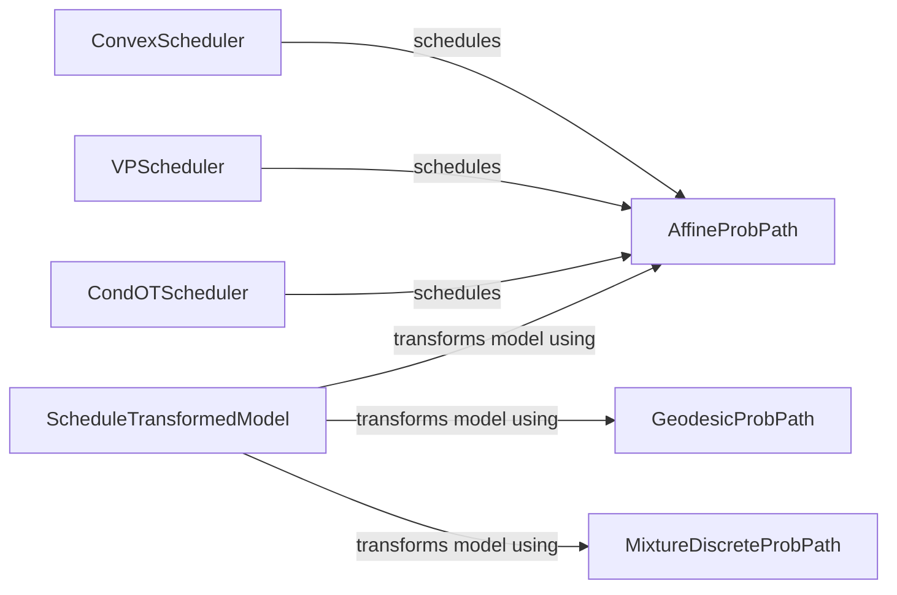

## Component Details

This component defines the probability paths and scheduling strategies for controlling the diffusion process, guiding the transformation from an initial to a target distribution. It encompasses various path types like affine, geodesic, and mixture paths, along with different scheduling methods to manipulate the model during the diffusion process. The core purpose is to provide a flexible and controllable mechanism for defining and executing the diffusion process.

### AffineProbPath
Defines a probability path using an affine transformation between two distributions. It provides a method to sample points along this defined path, enabling the generation of intermediate states during the diffusion process.
- **Related Classes/Methods**: `flow_matching.flow_matching.path.affine.AffineProbPath:sample`

### GeodesicProbPath
Defines a probability path as the geodesic (shortest path) between two distributions. It allows sampling of points along this geodesic path, offering an alternative to affine transformations for generating intermediate states.
- **Related Classes/Methods**: `flow_matching.flow_matching.path.geodesic.GeodesicProbPath:sample`

### MixtureDiscreteProbPath
Defines a probability path as a mixture of discrete probability distributions. It provides methods for sampling from the mixture and calculating the velocity field required to move between distributions, useful for discrete or categorical data.
- **Related Classes/Methods**: `flow_matching.flow_matching.path.mixture.MixtureDiscreteProbPath:sample`, `flow_matching.flow_matching.path.mixture.MixtureDiscreteProbPath:posterior_to_velocity`

### ScheduleTransformedModel
Transforms a model based on a defined schedule. This involves modifying the model's parameters or outputs according to the schedule, allowing for controlled changes to the model's behavior during the diffusion process. It acts as a wrapper around the core model.
- **Related Classes/Methods**: `flow_matching.flow_matching.path.scheduler.schedule_transform.ScheduleTransformedModel:__init__`

### ConvexScheduler
A scheduler that defines a convex schedule for controlling the evolution of the probability path. It provides a method to calculate the signal-to-noise ratio (SNR) at different points in the schedule, influencing the diffusion process.
- **Related Classes/Methods**: `flow_matching.flow_matching.path.scheduler.scheduler.ConvexScheduler:snr_inverse`

### CondOTScheduler
A specialized scheduler designed for use with CondOTProbPath. It defines the specific schedule for the conditional optimal transport path, controlling how the path evolves over time based on OT principles.
- **Related Classes/Methods**: `flow_matching.flow_matching.path.scheduler.scheduler.CondOTScheduler:__call__`

### VPScheduler
A scheduler based on Variance Preserving (VP) stochastic differential equations (SDEs). It defines the schedule based on VP principles, influencing the variance and mean of the diffusion process.
- **Related Classes/Methods**: `flow_matching.flow_matching.path.scheduler.scheduler.VPScheduler:__call__`
