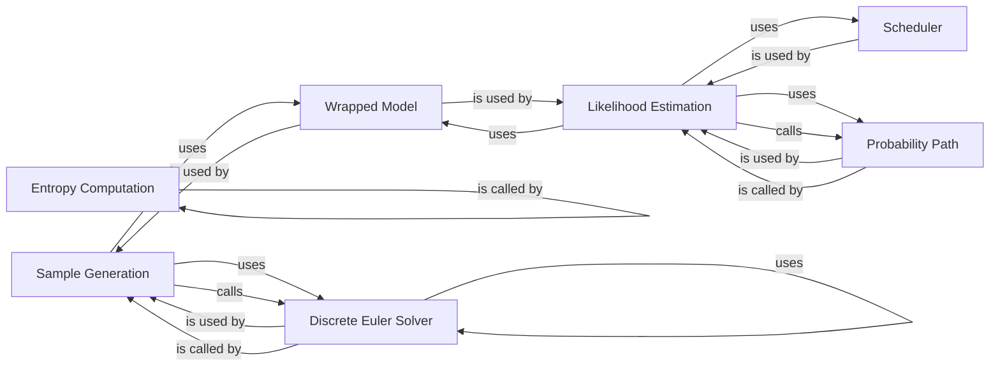

## Component Details

### Sample Generation
This component focuses on generating new samples from a trained model using a discrete Euler solver. It orchestrates the process of iteratively refining samples based on the flow matching objective, leveraging a wrapped model to adapt the model's output for compatibility with the solver.
- **Related Classes/Methods**: `repos.flow_matching.examples.text.logic.generate:generate_samples`, `repos.flow_matching.examples.text.logic.generate.WrappedModel`, `flow_matching.solver.discrete_solver.MixtureDiscreteEulerSolver`, `flow_matching.solver.discrete_solver.MixtureDiscreteEulerSolver.sample`

### Entropy Computation
This component calculates the entropy of a distribution to measure its uncertainty. It involves sampling from the distribution and then computing the entropy based on these samples. The entropy provides insights into the diversity and randomness of the generated samples.
- **Related Classes/Methods**: `repos.flow_matching.examples.text.logic.evaluate:compute_entropy`, `repos.flow_matching.examples.text.logic.evaluate:_sample_entropy`

### Likelihood Estimation
This component estimates the likelihood of a given sample, indicating how well the sample fits the learned distribution. It utilizes a wrapped model, a polynomial convex scheduler, and a mixture discrete probability path to compute the likelihood. The likelihood score reflects the plausibility of the generated sample according to the model.
- **Related Classes/Methods**: `repos.flow_matching.examples.text.logic.evaluate:estimate_likelihood`, `repos.flow_matching.examples.text.logic.evaluate.WrappedModel`, `flow_matching.path.scheduler.scheduler.PolynomialConvexScheduler`, `flow_matching.path.mixture.MixtureDiscreteProbPath`, `flow_matching.loss.generalized_loss.MixturePathGeneralizedKL`, `flow_matching.path.mixture.MixtureDiscreteProbPath.sample`

### Wrapped Model
This component adapts the underlying model for both sample generation and likelihood estimation. It ensures that the model's output is compatible with the solver and other components involved in the generation and evaluation processes.
- **Related Classes/Methods**: `repos.flow_matching.examples.text.logic.generate.WrappedModel`, `repos.flow_matching.examples.text.logic.evaluate.WrappedModel`

### Discrete Euler Solver
This component implements a discrete Euler solver for mixture models. It iteratively refines samples based on the flow matching objective, playing a crucial role in the sample generation process.
- **Related Classes/Methods**: `flow_matching.solver.discrete_solver.MixtureDiscreteEulerSolver`, `flow_matching.solver.discrete_solver.MixtureDiscreteEulerSolver.sample`, `flow_matching.utils.categorical_sampler.categorical`, `flow_matching.solver.utils.get_nearest_times`

### Probability Path
This component defines the trajectory for likelihood estimation in mixture models. It provides samples along the defined trajectory and is used in conjunction with a scheduler and a generalized KL divergence loss.
- **Related Classes/Methods**: `flow_matching.path.mixture.MixtureDiscreteProbPath`, `flow_matching.path.mixture.MixtureDiscreteProbPath.sample`

### Scheduler
This component controls the evolution of the probability path during likelihood estimation. It uses a polynomial convex scheduler to manage the trajectory.
- **Related Classes/Methods**: `flow_matching.path.scheduler.scheduler.PolynomialConvexScheduler`
