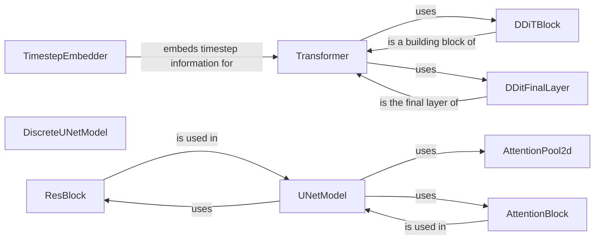

## Component Details

The Generative Models component encompasses the neural network architectures used for generating data, including text and images. It provides the building blocks and complete models necessary for implementing generative diffusion processes. The core functionality revolves around defining the structure and forward pass of Transformer-based models for text and UNet-based models for image generation. These models are composed of various sub-components like attention mechanisms, residual blocks, and normalization layers, which are orchestrated to produce high-quality generated samples.

### TimestepEmbedder
Embeds the timestep information into a vector representation, which is then used to condition the transformer model. This allows the model to understand the progression of the diffusion process and generate data accordingly. It transforms a scalar timestep value into a higher-dimensional vector that captures the temporal context.
- **Related Classes/Methods**: `flow_matching.examples.text.model.transformer.TimestepEmbedder:forward`

### DDiTBlock
A building block of the DDiT (Denoising Diffusion Implicit Transformer) model, performing operations like attention and feedforward transformations. It processes the input and timestep embeddings to refine the generated output. Each block typically consists of multiple layers, including self-attention and feedforward networks, with residual connections for improved training stability.
- **Related Classes/Methods**: `flow_matching.examples.text.model.transformer.DDiTBlock:__init__`, `flow_matching.examples.text.model.transformer.DDiTBlock:forward`

### DDitFinalLayer
The final layer of the DDiT model, responsible for producing the final output. It transforms the output of the DDiT blocks into the desired format, often involving a linear transformation and normalization. This layer ensures that the output is in the correct scale and distribution for the generation task.
- **Related Classes/Methods**: `flow_matching.examples.text.model.transformer.DDitFinalLayer:__init__`, `flow_matching.examples.text.model.transformer.DDitFinalLayer:forward`

### Transformer
The main transformer model for text generation, composed of multiple DDiT blocks, a timestep embedder, and a final layer. It orchestrates the generation process by passing data through these components. The transformer architecture leverages self-attention mechanisms to capture long-range dependencies in the input sequence, enabling coherent and contextually relevant text generation.
- **Related Classes/Methods**: `flow_matching.examples.text.model.transformer.Transformer:__init__`, `flow_matching.examples.text.model.transformer.Transformer:forward`

### DiscreteUNetModel
A UNet model designed for discrete data, used for image data generation. It processes the input image through a series of downsampling and upsampling layers with skip connections. The UNet architecture is well-suited for image generation tasks, as it preserves fine-grained details while capturing global context.
- **Related Classes/Methods**: `flow_matching.examples.image.models.discrete_unet.DiscreteUNetModel:__post_init__`, `flow_matching.examples.image.models.discrete_unet.DiscreteUNetModel:forward`

### AttentionPool2d
A layer that performs attention pooling on 2D feature maps, used within the UNet model. It reduces the spatial dimensions of the feature maps while retaining important information. Attention pooling allows the model to focus on the most relevant features in the image, improving the quality of the generated output.
- **Related Classes/Methods**: `flow_matching.examples.image.models.unet.AttentionPool2d:__init__`, `flow_matching.examples.image.models.unet.AttentionPool2d:forward`

### ResBlock
A residual block, a common building block in UNet models. It helps to train deeper networks by allowing the gradient to flow more easily. Residual connections enable the model to learn more complex features without suffering from vanishing gradients.
- **Related Classes/Methods**: `flow_matching.examples.image.models.unet.ResBlock:__init__`, `flow_matching.examples.image.models.unet.ResBlock:_forward`

### AttentionBlock
A block that performs attention operations, used within the UNet model. It allows the model to focus on the most relevant parts of the feature maps. Attention mechanisms enable the model to selectively attend to different regions of the image, improving its ability to capture long-range dependencies and generate high-quality images.
- **Related Classes/Methods**: `flow_matching.examples.image.models.unet.AttentionBlock:__init__`, `flow_matching.examples.image.models.unet.AttentionBlock:_forward`

### UNetModel
The main UNet model for image generation, composed of multiple ResBlocks, AttentionBlocks, and other layers. It processes the input image through a series of downsampling and upsampling layers with skip connections to generate the output image. The UNet architecture is widely used for image generation tasks due to its ability to capture both local and global context.
- **Related Classes/Methods**: `flow_matching.examples.image.models.unet.UNetModel:__post_init__`, `flow_matching.examples.image.models.unet.UNetModel:forward`
