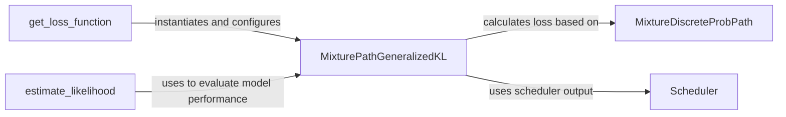

## Component Details

### MixturePathGeneralizedKL
Represents a specific loss function, the Mixture Path Generalized KL divergence, used in flow matching models. It calculates the divergence between the learned flow and the target data distribution, guiding the optimization process. This class encapsulates the mathematical formulation of the loss and its computation, taking into account the mixture path and the scheduler.
- **Related Classes/Methods**: `flow_matching.loss.generalized_loss.MixturePathGeneralizedKL`

### MixtureDiscreteProbPath
Defines the probability path for discrete flow matching. It specifies how the probability distribution evolves along the path, which is crucial for calculating the loss. The `MixtureDiscreteProbPath` defines the transition probabilities and mixing coefficients that govern the evolution of the data distribution during the flow matching process.
- **Related Classes/Methods**: `flow_matching.path.mixture.MixtureDiscreteProbPath`

### Scheduler
The scheduler component is responsible for managing the evolution of the diffusion process over time. It defines the schedule for parameters like alpha and kappa, which control the noise level and the speed of the diffusion. The scheduler's output is used by the loss function to weight the different terms in the loss. It provides the time-dependent parameters that govern the diffusion process.
- **Related Classes/Methods**: `flow_matching.path.scheduler.scheduler.Scheduler`

### get_loss_function
Retrieves or constructs the appropriate loss function (e.g., MixturePathGeneralizedKL) for training the flow matching model based on provided hyperparameters or configuration settings. This function acts as a factory, creating and configuring the loss function based on the specified parameters.
- **Related Classes/Methods**: `repos.flow_matching.examples.text.logic.flow:get_loss_function`

### estimate_likelihood
Estimates the likelihood of data under the learned flow matching model using the trained model and data points. It potentially uses techniques like importance sampling or numerical integration and interacts with the loss function to evaluate model performance. This component provides a way to assess how well the model fits the data.
- **Related Classes/Methods**: `repos.flow_matching.examples.text.logic.evaluate:estimate_likelihood`
