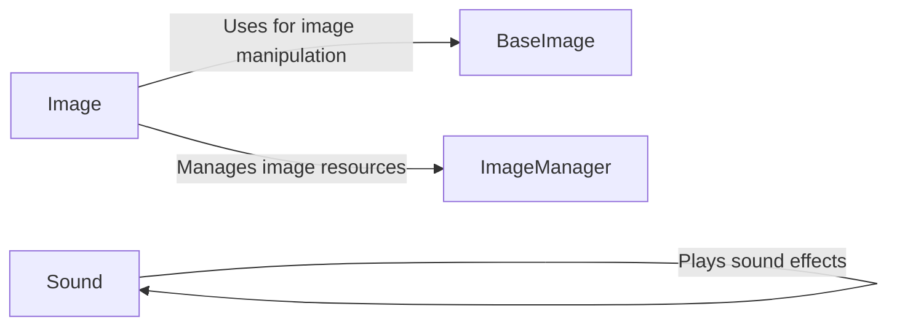

## Component Details

The Media Management subsystem in pygame-menu is responsible for handling all media assets, including images and sounds. It provides a centralized interface for loading, manipulating, and playing these assets, ensuring efficient resource management and simplifying the integration of multimedia elements into the menu design. The core components include classes for managing images (`BaseImage`, `Image`, `ImageManager`) and sounds (`Sound`), along with widgets that utilize these components to display images and play sound effects within the menu.

### BaseImage
The `BaseImage` class serves as an abstraction layer over Pygame surfaces, providing functionalities for image manipulation such as cropping, scaling, resizing, rotating, and pixel-level access. It simplifies image handling tasks within the pygame-menu library.
- **Related Classes/Methods**: `pygame_menu.baseimage.BaseImage`

### Sound
The `Sound` class manages sound effects within pygame-menu. It allows loading, playing, stopping, pausing, and unpausing sounds. It also provides methods for playing specific sound types, such as click sounds, error sounds, and menu open/close sounds, offering a centralized sound management system.
- **Related Classes/Methods**: `pygame_menu.sound.Sound`

### Image
The `Image` widget displays images within a menu. It inherits from a base widget class and utilizes the `BaseImage` class for image manipulation. It provides methods for setting the image, scaling, resizing, rotating, and flipping it. The `Image` widget is responsible for rendering the image on the screen.
- **Related Classes/Methods**: `pygame_menu.widgets.widget.image.Image`

### ImageManager
The `ImageManager` class handles the loading and caching of images. It is responsible for managing image resources and ensuring that images are loaded efficiently. It likely retrieves a specific image from the manager.
- **Related Classes/Methods**: `pygame_menu.widgets.widget.image.ImageManager`
