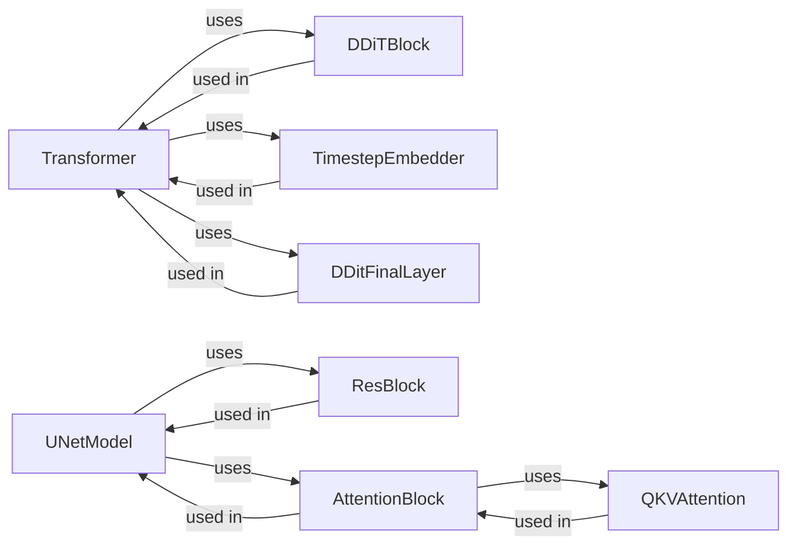

## Component Details

### Transformer
The Transformer model is designed for processing sequential data, leveraging self-attention mechanisms to capture dependencies between elements in the input sequence. It consists of a stack of DDiTBlocks, a TimestepEmbedder, and a DDitFinalLayer. The Transformer interacts with the TimestepEmbedder to incorporate time information and uses DDiTBlocks for the core processing layers.
- **Related Classes/Methods**: `repos.flow_matching.examples.text.model.transformer.Transformer`

### DDiTBlock
The DDiTBlock serves as a fundamental building block within the Transformer model, specifically designed for DDiT (Denoising Diffusion Implicit Transformer) architectures. It incorporates layers for normalization (LayerNorm), rotary embeddings (apply_rotary_emb_torch), and attention mechanisms (bias_dropout_add_scale).
- **Related Classes/Methods**: `repos.flow_matching.examples.text.model.transformer.DDiTBlock`

### TimestepEmbedder
The TimestepEmbedder component is responsible for embedding the timestep into a vector representation, which is then used to condition the transformer model. It transforms a scalar timestep value into a higher-dimensional vector that can be used as input to the Transformer model. This allows the model to be aware of the time step and adjust its behavior accordingly.
- **Related Classes/Methods**: `repos.flow_matching.examples.text.model.transformer.TimestepEmbedder`

### DDitFinalLayer
The DDitFinalLayer represents the concluding layer of the DDiT model, applying layer normalization and modulation to the output received from the DDiTBlocks. It performs final normalization and modulation steps on the output of the DDiTBlocks before producing the final output of the Transformer model.
- **Related Classes/Methods**: `repos.flow_matching.examples.text.model.transformer.DDitFinalLayer`

### UNetModel
The UNetModel is an architecture tailored for image processing tasks, comprising ResBlocks, AttentionBlocks, downsampling, and upsampling layers. The UNetModel processes image data by using a series of convolutional layers, residual connections, and attention mechanisms. It interacts with ResBlocks and AttentionBlocks to perform the core processing steps and uses downsampling and upsampling layers to adjust the spatial resolution of the feature maps.
- **Related Classes/Methods**: `repos.flow_matching.examples.image.models.unet.UNetModel`

### ResBlock
The ResBlock is a residual block employed within the UNet model, potentially incorporating upsampling, downsampling, and constant embedding layers. The ResBlock performs residual learning, which helps to improve the training and performance of the UNet model. It interacts with Upsample and Downsample layers to adjust the spatial resolution of the feature maps.
- **Related Classes/Methods**: `repos.flow_matching.examples.image.models.unet.ResBlock`

### AttentionBlock
The AttentionBlock is an attention mechanism utilized within the UNet model, employing QKVAttention or QKVAttentionLegacy for attention computations. The AttentionBlock allows the UNet model to focus on the most important parts of the input image. It interacts with QKVAttention to perform the attention calculations.
- **Related Classes/Methods**: `repos.flow_matching.examples.image.models.unet.AttentionBlock`

### QKVAttention
The QKVAttention mechanism is a core component of the AttentionBlock, responsible for calculating attention weights based on the query, key, and value inputs. The QKVAttention performs the core attention calculations in the AttentionBlock.
- **Related Classes/Methods**: `repos.flow_matching.examples.image.models.unet.QKVAttention`
