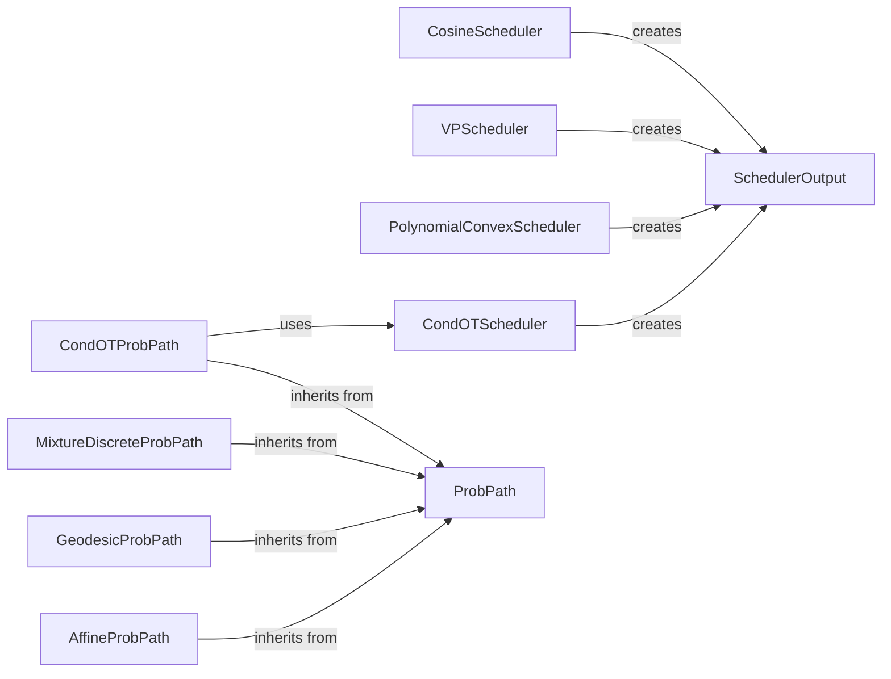

## Component Details

### AffineProbPath
The AffineProbPath component defines a probability path using affine transformations. It calculates the mean and variance of the data distribution at any point along the path, enabling the modeling of data evolution through linear transformations. This component inherits from ProbPath and utilizes helper functions like expand_tensor_like to ensure proper tensor dimensions during calculations.
- **Related Classes/Methods**: `flow_matching.path.affine.AffineProbPath`

### GeodesicProbPath
The GeodesicProbPath component defines a probability path using geodesic curves. It calculates the mean and variance of the data distribution along the geodesic path, providing a way to model data evolution through curved trajectories. This component inherits from ProbPath and uses expand_tensor_like to handle tensor dimensions.
- **Related Classes/Methods**: `flow_matching.path.geodesic.GeodesicProbPath`

### MixtureDiscreteProbPath
The MixtureDiscreteProbPath component defines a probability path as a mixture of discrete probabilities. It calculates the probability distribution of the data at different points along the path by combining multiple discrete distributions. This component inherits from ProbPath and uses helper functions like expand_tensor_like and unsqueeze_to_match for tensor manipulation. It also creates DiscretePathSample objects to represent samples along the path.
- **Related Classes/Methods**: `flow_matching.path.mixture.MixtureDiscreteProbPath`

### CondOTProbPath
The CondOTProbPath component defines a conditional optimal transport probability path. It models the evolution of the data distribution under optimal transport conditions, guided by a CondOTScheduler. This component inherits from ProbPath and relies on the scheduler to provide the necessary parameters for the optimal transport process.
- **Related Classes/Methods**: `flow_matching.path.affine.CondOTProbPath`

### PolynomialConvexScheduler
The PolynomialConvexScheduler component defines the evolution of noise during the diffusion process using a polynomial function. It calculates the noise level (beta, alpha, sigma) at different time steps and outputs these parameters as a SchedulerOutput object. This scheduler provides a flexible way to control the noise schedule.
- **Related Classes/Methods**: `flow_matching.path.scheduler.scheduler.PolynomialConvexScheduler`

### VPScheduler
The VPScheduler component defines the noise schedule based on the Variance Preserving (VP) diffusion principle. It calculates the noise level (beta, alpha, sigma) at different time steps, ensuring that the variance of the data is preserved during the diffusion process. The output is a SchedulerOutput object.
- **Related Classes/Methods**: `flow_matching.path.scheduler.scheduler.VPScheduler`

### CosineScheduler
The CosineScheduler component defines the noise schedule using a cosine function. It calculates the noise level (beta, alpha, sigma) at different time steps, providing a smooth and controlled noise evolution. The output is a SchedulerOutput object.
- **Related Classes/Methods**: `flow_matching.path.scheduler.scheduler.CosineScheduler`

### CondOTScheduler
The CondOTScheduler component is specifically designed for conditional optimal transport. It controls the parameters of the optimal transport process, such as the transport cost and regularization strength. It outputs these parameters as a SchedulerOutput object, which is then used by the CondOTProbPath.
- **Related Classes/Methods**: `flow_matching.path.scheduler.scheduler.CondOTScheduler`

### ProbPath
The ProbPath component is an abstract base class for probability paths. It defines the interface for all probability path implementations, ensuring that they provide methods for calculating the mean and variance of the data distribution along the path. Concrete path implementations, such as AffineProbPath, GeodesicProbPath, MixtureDiscreteProbPath and CondOTProbPath, inherit from this class.
- **Related Classes/Methods**: `flow_matching.path.path.ProbPath`

### SchedulerOutput
The SchedulerOutput component is a data structure that holds the output of a scheduler, including parameters like beta, alpha, and sigma. It's used to pass the scheduler's output to other components, such as the probability path implementations. This component facilitates the communication of scheduler parameters to the path implementations.
- **Related Classes/Methods**: `flow_matching.path.scheduler.scheduler.SchedulerOutput`
