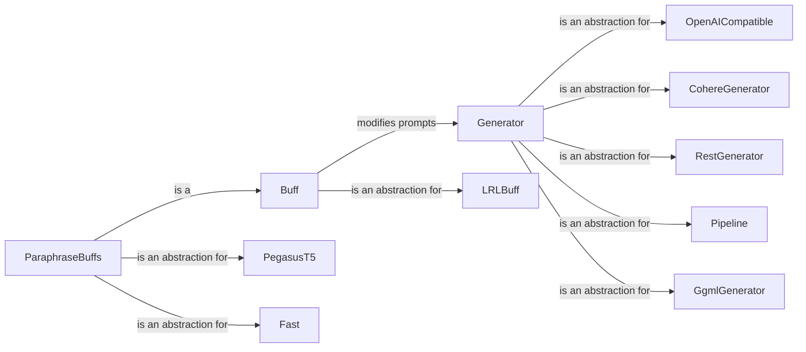

## Component Details

The Prompt Engineering subsystem in Garak focuses on generating and manipulating prompts for language models. It provides an abstraction layer for interacting with different LLM APIs through the Generator component and offers a mechanism to modify prompts using Buffs. The core purpose is to facilitate the testing of LLMs by providing diverse and potentially adversarial prompts, uncovering vulnerabilities and biases.

### Generator
The Generator component serves as an abstract base class for interacting with various language models. It defines a common interface for generating text from prompts, abstracting away the specifics of the underlying model API. Concrete implementations handle communication with specific LLMs like OpenAI, Cohere, and Hugging Face, providing a unified way to send prompts and receive responses.
- **Related Classes/Methods**: `garak.generators.base.Generator`, `garak.generators.openai.OpenAICompatible`, `garak.generators.cohere.CohereGenerator`, `garak.generators.rest.RestGenerator`, `garak.generators.huggingface.Pipeline`, `garak.generators.ggml.GgmlGenerator`

### Buff
The Buff component represents transformations applied to prompts before they are sent to the LLM. Buffs are used to explore different variations of prompts and uncover vulnerabilities that might not be apparent with the original prompt. It includes base classes and specific implementations for tasks like paraphrasing and low-resource language translation, enabling targeted testing scenarios.
- **Related Classes/Methods**: `garak.buffs.base.Buff`, `garak.buffs.low_resource_languages.LRLBuff`, `garak.buffs.paraphrase.PegasusT5`, `garak.buffs.paraphrase.Fast`

### OpenAICompatible
The OpenAICompatible component is a subclass of Generator that provides compatibility with OpenAI's API. It handles authentication, request formatting, and response parsing for OpenAI models, simplifying the process of interacting with OpenAI's language models.
- **Related Classes/Methods**: `garak.generators.openai.OpenAICompatible`

### CohereGenerator
The CohereGenerator component is a subclass of Generator that provides compatibility with Cohere's API. It handles authentication, request formatting, and response parsing for Cohere models, streamlining the interaction with Cohere's language models.
- **Related Classes/Methods**: `garak.generators.cohere.CohereGenerator`

### RestGenerator
The RestGenerator component is a subclass of Generator that provides a generic way to interact with RESTful APIs for language models. It allows specifying the API endpoint, request headers, and data format, offering flexibility in connecting to various LLMs through their REST interfaces.
- **Related Classes/Methods**: `garak.generators.rest.RestGenerator`

### Pipeline
The Pipeline component is a subclass of Generator that provides compatibility with Hugging Face Pipelines. It allows using pre-trained models from the Hugging Face Model Hub for text generation, enabling the use of a wide range of models with minimal configuration.
- **Related Classes/Methods**: `garak.generators.huggingface.Pipeline`

### GgmlGenerator
The GgmlGenerator component is a subclass of Generator that provides compatibility with GGML models. It allows using quantized models for efficient text generation, making it suitable for resource-constrained environments.
- **Related Classes/Methods**: `garak.generators.ggml.GgmlGenerator`

### LRLBuff
The LRLBuff component is a subclass of Buff that translates prompts into low-resource languages. It helps to test the model's robustness across different languages, uncovering potential biases or vulnerabilities related to language understanding.
- **Related Classes/Methods**: `garak.buffs.low_resource_languages.LRLBuff`

### ParaphraseBuffs
The ParaphraseBuffs component is a collection of Buffs that paraphrase prompts using different methods. It helps to test the model's sensitivity to different phrasings of the same prompt, uncovering potential vulnerabilities related to semantic understanding. Includes PegasusT5 and Fast implementations.
- **Related Classes/Methods**: `garak.buffs.paraphrase.PegasusT5`, `garak.buffs.paraphrase.Fast`
