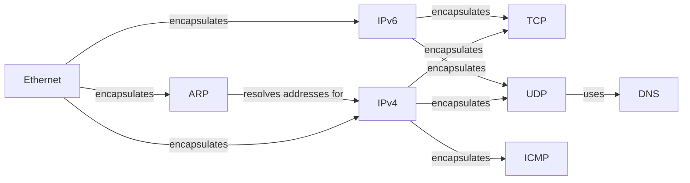

## Component Details

The ProtocolLibrary component in Scapy provides a comprehensive suite of tools for crafting, dissecting, and manipulating network packets across various layers of the network stack. It encompasses definitions and implementations for protocols like Ethernet, ARP, IPv4, IPv6, TCP, UDP, ICMP, DNS, and TLS, enabling users to construct custom packets, analyze network traffic, and perform network security testing. The library leverages a layered approach, where each layer builds upon the underlying layers to define the structure and behavior of packets at that level.

### Ethernet
Represents an Ethernet frame, defining fields for source and destination MAC addresses and encapsulating higher-layer protocols. It forms the foundation for network communication on local networks.
- **Related Classes/Methods**: `scapy.scapy.layers.l2.Ether`

### IPv4
Represents an IPv4 packet, handling IP addressing, routing, fragmentation, and checksum calculations. It is a fundamental protocol for routing packets across networks.
- **Related Classes/Methods**: `scapy.scapy.layers.inet.IP`

### IPv6
Represents an IPv6 packet, handling IPv6 addressing, routing, fragmentation, and checksum calculations. It is the next-generation IP protocol designed to replace IPv4.
- **Related Classes/Methods**: `scapy.scapy.layers.inet6.IPv6`

### TCP
Represents a TCP segment, handling TCP connection establishment, data transfer, and connection termination. It provides a reliable, connection-oriented transport mechanism.
- **Related Classes/Methods**: `scapy.scapy.layers.inet.TCP`

### UDP
Represents a UDP datagram, providing a connectionless transport mechanism. It is suitable for applications that require low latency and can tolerate some data loss.
- **Related Classes/Methods**: `scapy.scapy.layers.inet.UDP`

### ICMP
Implements the Internet Control Message Protocol (ICMP) for IPv4, used for error reporting and network diagnostics. It is essential for network troubleshooting and management.
- **Related Classes/Methods**: `scapy.scapy.layers.inet.ICMP`

### ARP
Implements the Address Resolution Protocol (ARP) for resolving IP addresses to MAC addresses on a local network. It is crucial for communication within a local network segment.
- **Related Classes/Methods**: `scapy.scapy.layers.l2.ARP`

### DNS
Implements the Domain Name System (DNS) protocol for resolving domain names to IP addresses. It enables users to interact with network resources using human-readable names.
- **Related Classes/Methods**: `scapy.scapy.layers.dns`
