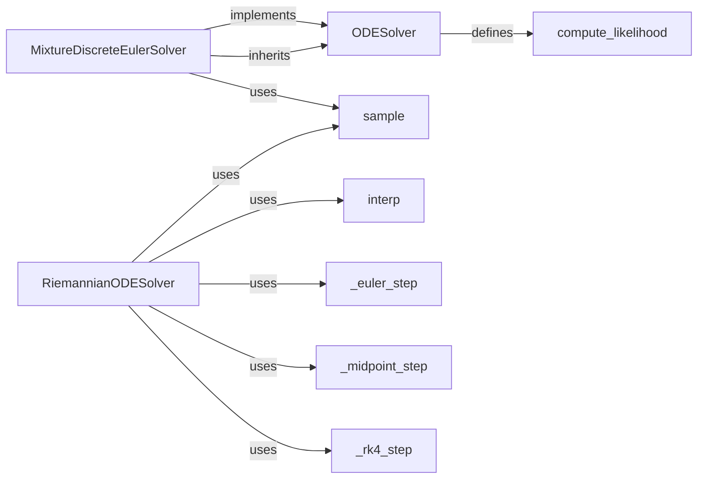

## Component Details

The Sampling Solvers component provides different ODE solvers for generating samples from the learned flow, effectively reversing the diffusion process. It includes Riemannian ODE solvers and discrete solvers, each implementing methods for integrating the learned vector field along the defined probability path. The solvers also offer functionalities for computing likelihoods and interpolating between points along the flow.

### RiemannianODESolver
RiemannianODESolver is a base class for ODE solvers that operate on Riemannian manifolds. It provides methods for sampling from the learned flow and interpolating between points. It includes implementations for Euler, Midpoint, and RK4 integration steps.
- **Related Classes/Methods**: `flow_matching.flow_matching.solver.riemannian_ode_solver.RiemannianODESolver`, `flow_matching.flow_matching.solver.riemannian_ode_solver:_euler_step`, `flow_matching.flow_matching.solver.riemannian_ode_solver:_midpoint_step`, `flow_matching.flow_matching.solver.riemannian_ode_solver:_rk4_step`, `flow_matching.flow_matching.solver.riemannian_ode_solver:sample`, `flow_matching.flow_matching.solver.riemannian_ode_solver:interp`

### MixtureDiscreteEulerSolver
MixtureDiscreteEulerSolver is a discrete solver that uses the Euler method for sampling from mixture models. It takes discrete steps to reverse the diffusion process and generate samples.
- **Related Classes/Methods**: `flow_matching.flow_matching.solver.discrete_solver.MixtureDiscreteEulerSolver`, `flow_matching.flow_matching.solver.discrete_solver.MixtureDiscreteEulerSolver:sample`

### ODESolver
ODESolver is a base class for ODE solvers, providing a method for computing the likelihood of observed data under the learned flow. This measures how well the flow model fits the data.
- **Related Classes/Methods**: `flow_matching.flow_matching.solver.ode_solver.ODESolver`, `flow_matching.flow_matching.solver.ode_solver.ODESolver:compute_likelihood`

### sample
The sample method generates samples from the learned flow using a specific ODE solver. It integrates initial data backward in time to produce samples.
- **Related Classes/Methods**: `flow_matching.flow_matching.solver.riemannian_ode_solver.RiemannianODESolver:sample`, `flow_matching.flow_matching.solver.discrete_solver.MixtureDiscreteEulerSolver:sample`

### compute_likelihood
The compute_likelihood method calculates the likelihood of observed data under the learned flow, quantifying how well the model explains the data.
- **Related Classes/Methods**: `flow_matching.flow_matching.solver.ode_solver.ODESolver:compute_likelihood`

### interp
The interp method interpolates between points along the learned flow, estimating intermediate states for visualization or analysis.
- **Related Classes/Methods**: `flow_matching.flow_matching.solver.riemannian_ode_solver:interp`

### _euler_step
The _euler_step method implements a single Euler step for solving the ODE, updating the state based on the current vector field and step size.
- **Related Classes/Methods**: `flow_matching.flow_matching.solver.riemannian_ode_solver:_euler_step`

### _midpoint_step
The _midpoint_step method implements a single Midpoint step for solving the ODE, providing a more accurate second-order integration method.
- **Related Classes/Methods**: `flow_matching.flow_matching.solver.riemannian_ode_solver:_midpoint_step`

### _rk4_step
The _rk4_step method implements a single RK4 step for solving the ODE, offering a higher-order, more accurate integration method.
- **Related Classes/Methods**: `flow_matching.flow_matching.solver.riemannian_ode_solver:_rk4_step`
