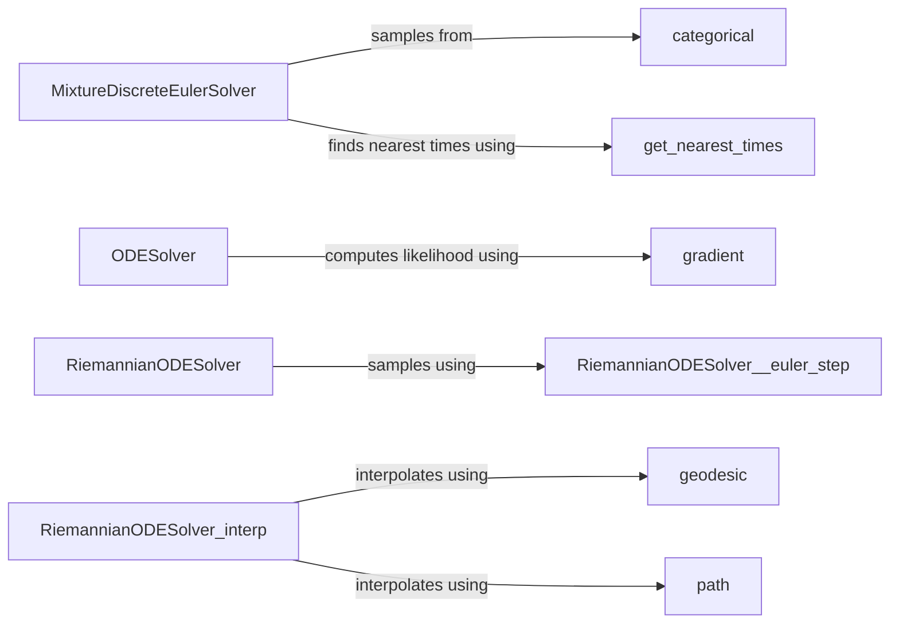

## Component Details

### MixtureDiscreteEulerSolver
The MixtureDiscreteEulerSolver is a solver specifically designed for discrete-time flow matching models. It employs a mixture of Euler steps to sample from the probabilistic paths. The solver predicts posterior probabilities using a model and samples from a categorical distribution based on these probabilities. It also incorporates a divergence-free term to enhance sampling quality and interacts with the MixtureDiscreteProbPath to compute the probability velocity.
- **Related Classes/Methods**: `flow_matching.solver.discrete_solver.MixtureDiscreteEulerSolver`, `flow_matching.solver.discrete_solver.MixtureDiscreteEulerSolver.sample`

### ODESolver
The ODESolver serves as a generic solver for ordinary differential equations, suitable for continuous-time flow matching models. It offers methods for calculating the likelihood of data under the model by integrating the reverse-time stochastic differential equation (SDE). This solver relies on numerical integration techniques and interacts with the model to evaluate the vector field of the ODE.
- **Related Classes/Methods**: `flow_matching.solver.ode_solver.ODESolver`, `flow_matching.solver.ode_solver.ODESolver.compute_likelihood`

### RiemannianODESolver
The RiemannianODESolver is an ODE solver tailored for Riemannian manifolds. It provides methods for performing Euler, midpoint, and RK4 steps on the manifold. Geodesic interpolation is used to approximate the solution path, and the solver interacts with the manifold to perform operations such as computing geodesics and tangent vectors.
- **Related Classes/Methods**: `flow_matching.solver.riemannian_ode_solver.RiemannianODESolver`, `flow_matching.solver.riemannian_ode_solver.RiemannianODESolver.sample`, `flow_matching.solver.riemannian_ode_solver._euler_step`, `flow_matching.solver.riemannian_ode_solver._midpoint_step`, `flow_matching.solver.riemannian_ode_solver._rk4_step`, `flow_matching.solver.riemannian_ode_solver.interp`

### get_nearest_times
The get_nearest_times function is a utility that identifies the times in a sequence that are closest to a target time. It is used to synchronize the solver's time steps with a predefined time grid, ensuring that the solution is returned at specific time points.
- **Related Classes/Methods**: `flow_matching.solver.utils.get_nearest_times`

### categorical
The categorical function samples from a categorical distribution. It takes a tensor of probabilities as input and returns a tensor of samples, where each sample represents an index corresponding to a category.
- **Related Classes/Methods**: `flow_matching.utils.categorical_sampler.categorical`

### gradient
The gradient function is a utility for computing the gradient of a given function. It is used to estimate the divergence of the vector field in the ODE solver, which is necessary for calculating the likelihood of the data under the model.
- **Related Classes/Methods**: `flow_matching.utils.utils.gradient`

### geodesic
The geodesic module is responsible for computing geodesics on Riemannian manifolds. It provides functions for finding the shortest path between two points on the manifold, which is used for interpolation in the Riemannian ODE solver.
- **Related Classes/Methods**: `flow_matching.utils.manifolds.utils.geodesic`

### path
The path module is used for computing paths on Riemannian manifolds. It provides functions for defining and manipulating paths on the manifold, which are used for interpolation in the Riemannian ODE solver.
- **Related Classes/Methods**: `flow_matching.utils.manifolds.utils.geodesic.path`
