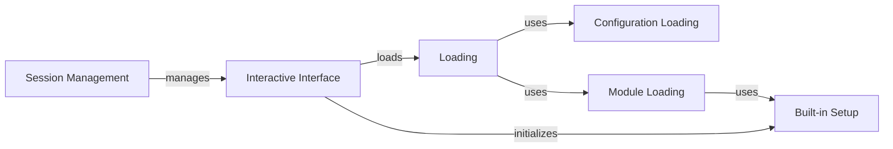

## Component Details

The SessionManager component in Scapy provides an interactive environment for users to craft, send, capture, and analyze network packets. It encompasses functionalities for configuration loading, module management, session persistence, and a command-line interface. The core purpose is to offer a versatile and user-friendly platform for network exploration and security testing.

### Configuration Loading
This component handles the loading of Scapy's configuration from files, determining the configuration and cache directories, and reading the configuration file. It ensures that Scapy's behavior is customized according to user preferences and system settings.
- **Related Classes/Methods**: `scapy.scapy.main:_probe_config_folder`, `scapy.scapy.main:_probe_cache_folder`, `scapy.scapy.main:_read_config_file`

### Module Loading
This component is responsible for loading Scapy modules, layers, and contrib packages, extending Scapy's capabilities. It allows users to import additional functionalities and protocols into Scapy, making it adaptable to various network environments.
- **Related Classes/Methods**: `scapy.scapy.main:load_module`, `scapy.scapy.main:load_layer`, `scapy.scapy.main:load_contrib`, `scapy.scapy.main:list_contrib`

### Built-in Setup
This component sets up built-in functions and extensions for Scapy, providing core functionalities. This includes defining essential functions and extending Scapy's capabilities with pre-defined tools, ensuring that Scapy has a solid foundation for packet manipulation and analysis.
- **Related Classes/Methods**: `scapy.scapy.main:_scapy_prestart_builtins`, `scapy.scapy.main:_scapy_builtins`, `scapy.scapy.main:_scapy_exts`

### Session Management
This component manages Scapy sessions, including saving, loading, and updating session data. It allows users to persist their work and resume it later, or to share sessions with others, promoting collaboration and efficient workflow.
- **Related Classes/Methods**: `scapy.scapy.main:save_session`, `scapy.scapy.main:load_session`, `scapy.scapy.main:update_session`, `scapy.scapy.main:init_session`

### Interactive Interface
This component provides the interactive environment for users to interact with Scapy, including preparing quotes and displaying a banner. It's the primary way users interact with Scapy, providing a command-line interface for packet manipulation and analysis.
- **Related Classes/Methods**: `scapy.scapy.main:_prepare_quote`, `scapy.scapy.main:get_fancy_banner`, `scapy.scapy.main:interact`

### Loading
This component loads a file or a module. This component acts as a central point for loading various resources into Scapy, including configuration files and modules.
- **Related Classes/Methods**: `scapy.scapy.main:_load`
