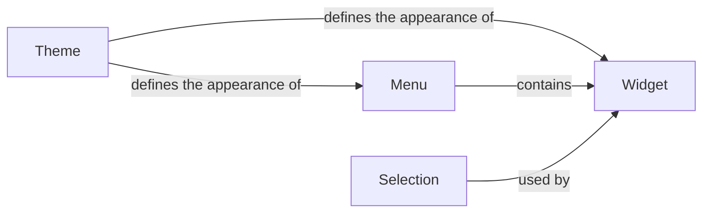

## Component Details

The Theme Manager in Pygame Menu is responsible for defining and applying visual styles to menus and widgets. It allows for customization of the menu's appearance, ensuring a consistent look and feel across the application. The core of the Theme Manager is the Theme class, which encapsulates all visual properties like colors, fonts, and background images. Menus and widgets then utilize the active Theme to render themselves, providing a unified user experience.

### Theme
Defines the visual style of the menu and its widgets, including colors, fonts, and background images. It provides a way to customize the appearance of the menu elements. It contains properties for various aspects of the menu, such as the widget's font, color, and background.
- **Related Classes/Methods**: `pygame_menu.themes.Theme`

### Menu
Represents the main menu structure, containing a collection of widgets and submenus. It handles user interaction and navigation within the menu. The menu applies the theme to its widgets during initialization and rendering.
- **Related Classes/Methods**: `pygame_menu.menu.Menu`

### Widget
Base class for all interactive elements within a menu, such as buttons, labels, and input fields. It provides common functionality for handling events, drawing, and managing appearance. Widgets use the theme to define their visual properties, such as font, color, and background.
- **Related Classes/Methods**: `pygame_menu.widgets.core.widget.Widget`

### Selection
Represents the visual selection indicator for widgets. It manages the color and background color of the selection. The selection style is defined by the theme, allowing for customization of the selection appearance.
- **Related Classes/Methods**: `pygame_menu.widgets.core.selection.Selection`
