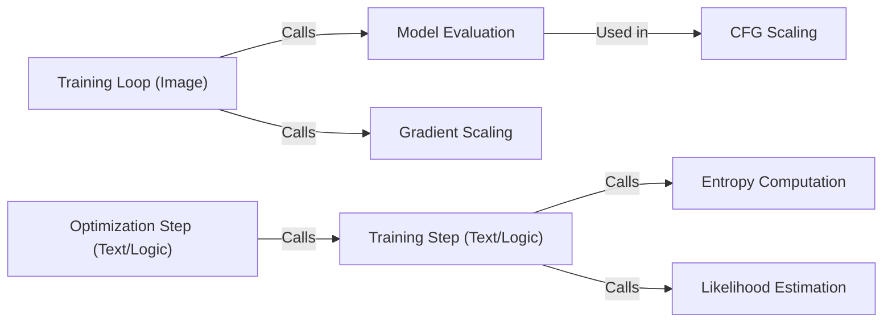

## Component Details

The Training and Evaluation component orchestrates the process of training and evaluating machine learning models. It encompasses the training loop, optimization steps, gradient scaling, and evaluation metric computation. The component manages the flow of data through the model, calculates loss and gradients, updates model parameters, and monitors performance using evaluation metrics. It supports both image and text/logic domains, adapting the training and evaluation procedures accordingly.

### Training Loop (Image)
The training loop for image models iterates through the dataset, performs forward and backward passes, and updates model parameters. It leverages gradient scaling to prevent underflow or overflow and interacts with the evaluation component to monitor performance during training.
- **Related Classes/Methods**: `flow_matching.examples.image.training.train_loop:train_one_epoch`

### Optimization Step (Text/Logic)
The optimization step for text/logic models computes the loss, calculates gradients, and updates model parameters using an optimizer. It represents a single step in the training process and is called repeatedly within the training loop.
- **Related Classes/Methods**: `flow_matching.examples.text.logic.training:optimization_step`

### Training Step (Text/Logic)
Represents a single training step in the text/logic domain, potentially encompassing data loading, forward pass, loss calculation, and backpropagation. It also computes entropy and estimates likelihood.
- **Related Classes/Methods**: `flow_matching.examples.text.logic.training:step`

### Gradient Scaling
Gradient scaling prevents underflow or overflow during training by scaling the loss and gradients. The scaling is applied before the backward pass and unscaled before the optimizer update.
- **Related Classes/Methods**: `flow_matching.examples.image.training.grad_scaler.NativeScalerWithGradNormCount:__call__`

### Model Evaluation
The model evaluation component evaluates the trained model on a validation or test dataset. It computes relevant metrics to assess the model's performance and can use conditional forward guidance scaling.
- **Related Classes/Methods**: `flow_matching.examples.image.training.eval_loop:eval_model`

### CFG Scaling
Wraps the model and scales the conditional forward guidance during evaluation in the image domain. This allows for controlling the influence of the conditional information during the evaluation process.
- **Related Classes/Methods**: `flow_matching.examples.image.training.eval_loop.CFGScaledModel:__init__`

### Entropy Computation
Computes the entropy of the model's output distribution in the text/logic domain. Entropy is a measure of uncertainty or randomness in the model's predictions.
- **Related Classes/Methods**: `flow_matching.examples.text.logic.evaluate:compute_entropy`

### Likelihood Estimation
Estimates the likelihood of the data under the model in the text/logic domain. Likelihood is a measure of how well the model fits the data.
- **Related Classes/Methods**: `flow_matching.examples.text.logic.evaluate:estimate_likelihood`
