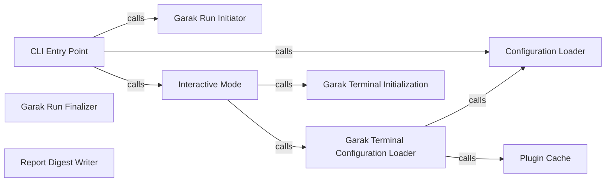

## Component Details

The User Interface component in Garak provides both a command-line interface (CLI) and an interactive mode for users to interact with the system. The CLI allows users to run Garak with specific configurations and probes, while the interactive mode offers a REPL-like environment for exploring configurations and running tests manually. The main flow involves parsing user input, loading configurations, initiating the Garak run, and displaying or storing the results.

### CLI Entry Point
The `garak.cli.main` function serves as the entry point for the command-line interface. It uses `argparse` to parse command-line arguments, determines the execution mode (interactive or command-line), loads the Garak configuration, and initiates the corresponding action. It orchestrates the overall execution flow based on user input.
- **Related Classes/Methods**: `garak.cli.main`

### Configuration Loader
The `garak._config.load_config` function is responsible for loading the configuration settings for Garak. It reads configuration files (e.g., YAML), sets up the environment based on the specified plugins, probes, detectors, and other parameters. This component is crucial for customizing Garak's behavior.
- **Related Classes/Methods**: `garak._config.load_config`

### Interactive Mode
The `garak.interactive.interactive_mode` function enables interactive exploration and assessment of language models through a terminal interface. It initializes and starts the `GarakTerminal`, providing a REPL-like environment where users can manually run probes, inspect results, and adjust configurations.
- **Related Classes/Methods**: `garak.interactive.interactive_mode`

### Garak Terminal Initialization
The `garak.interactive.GarakTerminal.__init__` method initializes the GarakTerminal, setting up the interactive environment. This includes initializing the terminal interface, loading the Garak configuration, and preparing the environment for user interaction.
- **Related Classes/Methods**: `garak.interactive.GarakTerminal.__init__`

### Garak Terminal Configuration Loader
The `garak.interactive.GarakTerminal._load_garak` method loads the Garak configuration and plugins within the interactive terminal. It calls `garak._config.load_config` to load the configuration and `garak._plugins.PluginCache.instance` to manage plugins.
- **Related Classes/Methods**: `garak.interactive.GarakTerminal._load_garak`

### Plugin Cache
The `garak._plugins.PluginCache.instance` method manages the caching and retrieval of plugins (probes, detectors, generators, buffs) used by Garak. It ensures that plugins are loaded and available when needed, optimizing performance by avoiding redundant loading.
- **Related Classes/Methods**: `garak._plugins.PluginCache.instance`

### Garak Run Initiator
The `garak.command.start_run` function initiates a Garak run based on the provided configuration. It sets up the necessary resources, prepares the probes and detectors, and starts the evaluation process.
- **Related Classes/Methods**: `garak.command.start_run`

### Garak Run Finalizer
The `garak.command.end_run` function finalizes a Garak run, performing cleanup and potentially generating final reports. It aggregates the results, saves them to a file, and performs any necessary post-processing.
- **Related Classes/Methods**: `garak.command.end_run`

### Report Digest Writer
The `garak.command.write_report_digest` function writes a summary or digest of the Garak run results to a report file. This provides a concise overview of the evaluation, including key metrics and findings.
- **Related Classes/Methods**: `garak.command.write_report_digest`
